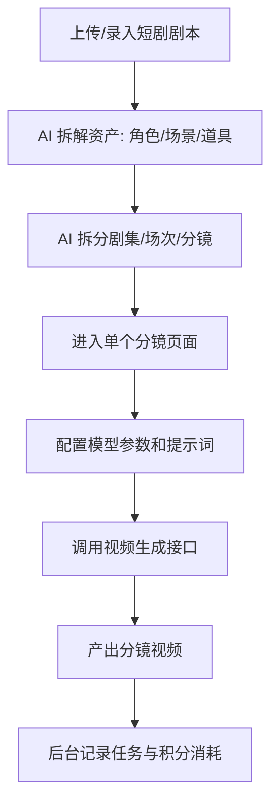
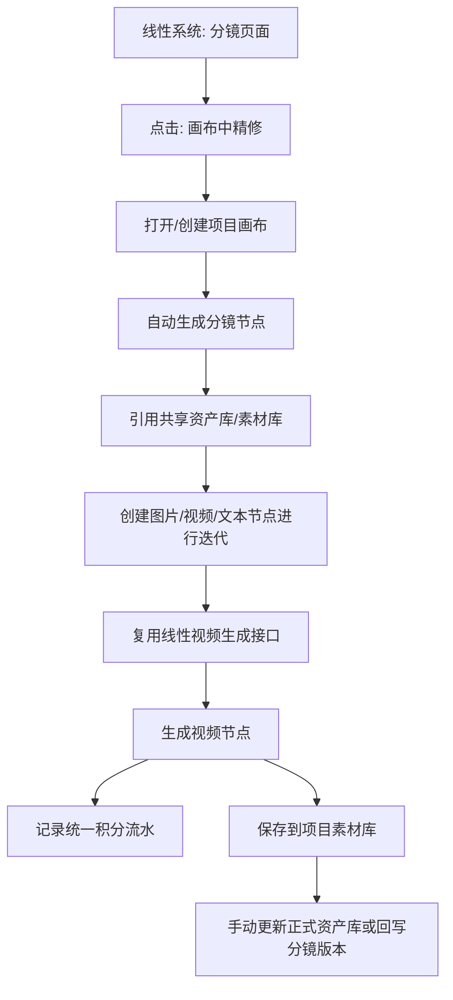
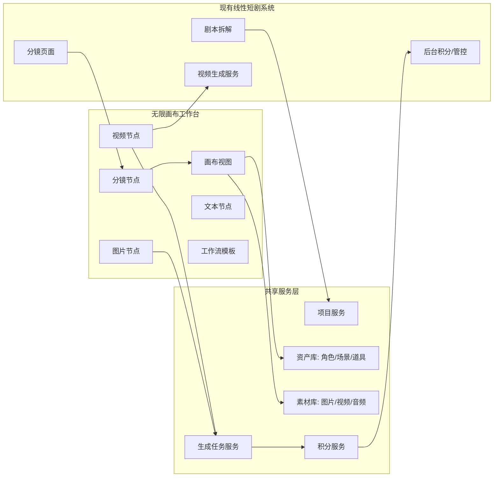

# KC 无限画布创作工作台 PRD v0.1

| 字段 | 内容 |
| --- | --- |
| 文档状态 | 草稿，待讨论 |
| 创建日期 | 2026-06-01 |
| 面向对象 | 业务方、技术负责人、前端开发、后端开发 |
| 产品定位 | 面向公司内部短剧生产的 LibTV 式无限画布创作工作台 |
| 当前阶段 | MVP 方案定义与交互原型适配 |

---

## 1. 背景与问题

公司现有短剧 AI 创作系统采用线性流水线模式，业务从一部短剧剧本开始，依次完成剧本拆解、资产拆解、分集分场分镜拆解、单分镜页面生成、模型参数配置、提示词输入和视频结果产出。

现有线性系统的优势是流程清晰、任务结构稳定、后台管控明确，适合按项目、导演组、人员和模型任务进行成本统计和业务追踪。但在创意迭代阶段，线性页面存在明显限制：

- 分镜、角色图、场景图、道具图、参考素材分散在不同页面，查看和对比效率低。
- 多轮生成结果只能在单个页面内上下翻找，不利于观察版本变化。
- 用户无法自由拖拽、连线、组合节点和自行整理创作空间，难以形成清晰的创作脉络。
- 已沉淀的工作流无法像模板一样跨项目复用。
- 业务方希望拥有类似 LibTV 的无限画布体验，在同一项目空间里完成素材管理、分镜迭代、图片/视频生成和结果复用。

因此，本项目不是替换现有线性系统，而是在现有系统基础上新增一个“无限画布创作视图”，用于承接创意发散、分镜精修、资产复用和工作流沉淀。

## 2. 产品定位

KC 无限画布创作工作台是一款面向公司内部短剧生产团队的 AI 创作画布。它与现有线性系统共享项目、分镜、资产、素材和积分数据，在画布中提供更自由的节点式创作体验。

产品定位可以概括为：

```text
线性系统负责标准生产流程、任务状态和后台管控。
无限画布负责创意发散、节点编排、版本对比和工作流复用。
两者共用资产库、素材库、视频生成服务和积分管控服务。
```

## 3. 产品目标

### 3.1 MVP 阶段目标

MVP 阶段的目标不是完整复刻 LibTV 的所有能力，而是跑通内部短剧项目的无限画布创作闭环：

- 用户可以从线性分镜页一键进入画布，对某一分镜进行自由精修。
- 用户可以按项目创建、打开和保存画布，保证画布与现有项目体系绑定。
- 用户可以在画布中拖入角色、场景、道具和素材，作为生成参考。
- 用户可以在画布中创建文本、图片、视频、分镜等节点，并进行拖拽、连线和多轮迭代。
- 用户可以复用现有线性系统的视频生成接口，生成结果以视频节点形式沉淀。
- 用户在画布中的模型消耗统一进入现有积分管控系统。
- 用户可以把画布中优化后的图片、视频保存为项目素材，或手动更新到正式资产库。
- 产品经理和前端工程师可以基于现有原型仓库继续适配演示，而不是从零搭建交互样板。

### 3.2 非目标

MVP 阶段暂不追求：

- 完整替换现有线性生产系统。
- 资产库、素材库和线性系统所有字段的完全双向同步。
- 多人实时协作。
- 完整时间线剪辑器。
- 自动分区、分镜组、场次组等强结构化画布管理能力。
- 面向外部用户的社区、会员、公开模板市场。
- Agent Skill 具体能力包和 Agent 全自动成片。

## 4. 目标用户与场景

| 用户角色 | 主要诉求 | 典型行为 |
| --- | --- | --- |
| 导演组业务人员 | 快速查看并调整分镜生成结果 | 从线性分镜页进入画布，围绕单个分镜做多轮图片/视频迭代 |
| 分镜/视频生成专员 | 批量管理参考素材和生成结果 | 在画布中拖入角色、场景、道具，连接到分镜或视频节点 |
| 资产管理员 | 维护角色、场景、道具的正式资产 | 选择保存为新资产或更新资产版本，并查看历史记录 |
| 项目负责人 | 控制项目成本和结果质量 | 查看项目画布、用量统计、重要分镜生成链路 |
| 后台管理员 | 管理积分、模型和权限 | 按项目、导演组、人员、模型维度查看消耗 |

## 5. 当前线性系统流程



## 6. 目标协同流程



## 7. 产品架构



## 8. MVP 分期策略

### 8.1 一期 MVP：画布可用 + 分镜可跳转 + 积分可管控

一期目标是让业务人员真实使用画布完成分镜微调和素材迭代，同时保证成本可控。

| 优先级 | 模块 | 功能 | 简述 |
| --- | --- | --- | --- |
| P0 | 画布基础 | 无限画布操作 | 缩放、平移、拖拽、框选、复制、删除、连线 |
| P0 | 项目管理 | 项目画布管理 | 画布与现有项目绑定，支持创建、打开、保存和最近项目 |
| P0 | 分镜互通 | 分镜页跳转画布 | 线性分镜视频可一键导入画布，生成分镜节点 |
| P0 | 分镜节点 | 分镜上下文承载 | 展示集、场、分镜描述、提示词、模型参数、结果视频 |
| P0 | 共享资产库 | 资产读取与引用 | 画布可搜索/拖入角色、场景、道具资产 |
| P0 | 共享素材库 | 素材读取与保存 | 画布可读取素材，也可保存结果到项目素材库 |
| P0 | 视频生成 | 复用线性视频接口 | 视频节点调用现有视频生成服务 |
| P0 | 积分管控 | 统一预扣与流水 | 所有模型调用必须进入现有积分系统 |
| P0 | 生成任务 | 任务状态管理 | 生成中、成功、失败、失败原因、结果地址 |
| P0 | 图片工具 | 裁剪、多角度、上传 | 支持当前原型已有核心图片编辑能力 |
| P0 | 下载导出 | 结果下载/画布导出 | 图片、视频可下载，项目画布可导出 |

### 8.2 二期：数据回写 + 批量生成 + 工作流复用

| 优先级 | 模块 | 功能 | 简述 |
| --- | --- | --- | --- |
| P1 | 分镜回写 | 画布结果回写线性分镜 | 将画布中选中的视频结果追加为分镜新版本 |
| P1 | 资产版本 | 更新正式资产版本 | 有权限用户确认后写入正式资产库，并保留历史版本 |
| P1 | 批量能力 | 批量生图/生视频 | 基于多个分镜节点批量执行生成 |
| P1 | 专业工具 | 角色三视图/九宫格/25宫格 | 复刻 LibTV 高频视觉能力 |
| P1 | 工作流模板 | 保存与复用 | 将节点组合保存为项目或团队模板 |

### 8.3 三期：深度协同 + 生产增强

| 优先级 | 模块 | 功能 | 简述 |
| --- | --- | --- | --- |
| P2 | 双向同步 | 分镜/素材/资产深度互通 | 支持更完整的数据同步和冲突处理 |
| P2 | 时间线 | 粗剪与合成 | 多视频节点拼接、音频叠加、导出 |
| P2 | 协作 | 多人协同 | 评论、任务分配、权限、协同查看 |
| P2 | 高级成本 | 预算预警与审批 | 超预算提醒、模型限额、审批流 |
| 预留 | Agent Skill | 内部自动化接口口子 | 先预留任务、节点、项目接口，不在当前阶段实现具体 Agent 能力包 |
| 观察 | 画布分区 | 自动分区/分镜组/场次组 | 暂不做，先让用户自行管理画布；后续根据真实使用需求再设计 |

## 9. 一期详细功能清单草案

### 9.1 项目画布管理

| 字段 | 内容 |
| --- | --- |
| 功能说明 | 无限画布必须绑定现有项目体系，用户以项目为单位创建、打开、保存和管理画布 |
| 用户入口 | 线性系统项目详情页、分镜页面“画布中精修”按钮、画布工作台项目列表 |
| 用户操作 | 用户进入某个项目后，可以打开该项目画布；如果项目尚未创建画布，则系统自动创建默认画布 |
| 系统规则 | 一期默认一个项目对应一个主画布；暂不做自动分区、分镜组、场次组 |
| 数据范围 | 画布内节点、连线、节点位置、节点参数、引用资产、引用素材、生成结果和任务记录均归属于当前项目 |
| 保存规则 | 画布状态自动保存，用户也可以手动触发保存；保存失败时需要提示并允许重试 |
| 验收标准 | 用户从项目或分镜进入画布后，能看到与该项目绑定的同一份画布数据 |

### 9.2 分镜页进入画布

| 字段 | 内容 |
| --- | --- |
| 功能说明 | 在线性系统的分镜页面提供“画布中精修”入口 |
| 用户入口 | 分镜页面右上角或生成结果区域 |
| 用户操作 | 点击按钮后进入该项目画布，并定位到对应分镜节点 |
| 系统规则 | 如果该分镜已有画布节点，则打开并定位；如果没有，则在项目主画布中自动创建 |
| 输出结果 | 画布中生成一个分镜节点，携带分镜上下文和历史视频结果 |
| 验收标准 | 用户从分镜页进入画布后，能在 3 秒内看到对应分镜节点和现有视频结果 |

### 9.3 分镜节点

| 字段 | 内容 |
| --- | --- |
| 功能说明 | 分镜节点是线性系统和画布的核心桥接节点 |
| 节点内容 | 集数、场次、分镜编号、分镜描述、提示词、模型参数、参考资产、生成视频 |
| 支持操作 | 拖拽、连线、复制、查看结果、发起视频生成、保存新版本 |
| 数据来源 | 线性系统分镜数据 |
| 数据输出 | 新图片节点、新视频节点、项目素材、分镜新版本 |
| 关键规则 | 画布生成结果默认不覆盖线性分镜原结果，只追加版本 |

### 9.4 共享资产库

| 字段 | 内容 |
| --- | --- |
| 功能说明 | 画布与线性系统共用角色、场景、道具资产库 |
| 用户入口 | 画布左侧资产面板、节点参考素材选择器 |
| 支持操作 | 搜索、筛选、拖入画布、引用到节点、保存为新资产、更新资产版本 |
| 写入规则 | 默认保存到项目素材库；有权限用户手动选择后才写入正式资产库 |
| 版本规则 | 暂不设置审核流程；资产更新必须生成历史版本记录，支持查看来源画布、来源节点、更新人和更新时间 |
| 验收标准 | 线性系统已有资产可在画布中被搜索、拖入和引用 |

### 9.5 共享素材库

| 字段 | 内容 |
| --- | --- |
| 功能说明 | 图片、视频、音频素材在画布和线性系统中共用 |
| 用户入口 | 左侧素材库、右键菜单、节点上传按钮 |
| 支持操作 | 上传、搜索、预览、拖入、复制、删除、下载、保存结果 |
| 素材范围 | 项目素材、个人素材、团队素材，具体权限沿用现有系统 |
| 验收标准 | 画布生成的视频结果可保存到项目素材，并能被线性视频节点调用 |

### 9.6 视频节点

| 字段 | 内容 |
| --- | --- |
| 功能说明 | 视频节点复用现有线性系统视频生成能力 |
| 输入 | 提示词、参考图片、参考视频、资产 ID、分镜上下文、模型参数 |
| 输出 | 视频 URL、封面图、任务状态、积分消耗 |
| 系统规则 | 调用前必须完成积分预扣；失败必须返还或解冻积分 |
| 验收标准 | 用户在画布中点击生成后，可看到任务状态和最终视频节点 |

### 9.7 积分管控

| 字段 | 内容 |
| --- | --- |
| 功能说明 | 画布所有模型调用统一接入现有积分服务 |
| 核心规则 | 预估消耗、预扣积分、任务执行、确认扣减、失败返还 |
| 统计维度 | 项目、导演组、用户、模型、任务类型、节点、分镜 |
| 最低要求 | 不允许绕过积分服务直接调用模型 |
| 验收标准 | 后台可查看画布产生的每一笔模型消耗流水 |

## 10. 数据字段定义草案

### 10.1 分镜节点核心字段

```json
{
  "canvas_node_id": "node_001",
  "node_type": "shot",
  "project_id": "project_001",
  "episode_id": "ep_001",
  "scene_id": "scene_001",
  "shot_id": "shot_001",
  "shot_name": "第1集-第2场-分镜3",
  "shot_description": "分镜描述",
  "prompt": "当前提示词",
  "negative_prompt": "负面提示词",
  "model_config": {},
  "reference_asset_ids": ["asset_role_001"],
  "reference_material_ids": ["mat_001"],
  "result_video_url": "https://example.com/video.mp4",
  "result_image_url": "https://example.com/cover.png",
  "generation_task_id": "task_001",
  "source": "linear_pipeline"
}
```

### 10.2 积分流水核心字段

```json
{
  "credit_record_id": "credit_001",
  "project_id": "project_001",
  "director_group_id": "group_001",
  "user_id": "user_001",
  "canvas_id": "canvas_001",
  "node_id": "node_001",
  "shot_id": "shot_001",
  "task_id": "task_001",
  "task_type": "video_generation",
  "model_vendor": "internal_video_service",
  "model_id": "linear_video_model",
  "estimated_credit": 10,
  "actual_credit": 9,
  "status": "confirmed",
  "created_at": "2026-06-01T00:00:00+08:00",
  "completed_at": "2026-06-01T00:01:00+08:00"
}
```

## 11. 正式前端选型建议

### 11.1 当前原型的定位

当前 `tapnow-base` 原型适合继续用于：

- 验证无限画布的核心交互。
- 验证节点参数面板和工具菜单。
- 验证本地上传、裁剪、多角度、素材库等体验。
- 生成产品方案所需的原型截图。
- 给前端工程师参考节点 UI 和业务交互。

当前原型不建议作为正式生产系统完整底座直接长期演进，因为它的画布事件系统是轻量自研，后续面对复杂多选、分组、撤销重做、大规模节点、嵌套工作流和性能优化时维护成本较高。

### 11.2 正式工程建议

正式前端建议采用：

```text
React + TypeScript + React Flow / xyflow + 现有业务组件复用
```

原因：

- React Flow 原生支持节点、连线、Handle、Viewport、缩放、平移和自定义节点。
- 后续如果需要分镜组、场次组、工作流模板时，React Flow 的 sub-flow / parent-child 节点能力更适合。
- 前端工程师可把当前原型中的节点 UI、参数面板、素材库、工具栏设计迁移到 React Flow 自定义节点中。
- 可以减少正式工程在基础画布交互上的自研成本。

## 12. 原型适配与截图计划

为了支持 PRD 和评审材料，当前线上原型需要按正式方案做一次“展示型适配”。适配目标不是完整接通真实后端，而是让界面和交互截图能准确表达 MVP 产品方案。

### 12.1 原型适配任务

| 阶段 | 任务 | 说明 |
| --- | --- | --- |
| A | 增加分镜节点 | 在当前原型中新增分镜节点 UI，展示集/场/分镜信息和视频结果 |
| A | 增加资产库面板 | 左侧面板区分角色、场景、道具、素材 |
| A | 增加积分展示 | 节点生成按钮或顶部区域展示预估积分 |
| A | 增加保存到资产库入口 | 生成结果工具条提供“保存到项目素材/更新正式资产” |
| B | 增加线性跳转模拟入口 | 用 mock 数据模拟从分镜页跳转到画布 |
| B | 增加后台积分看板原型 | 用静态数据展示项目/导演组/用户/模型消耗 |
| C | 增加工作流模板展示 | 展示节点组合可保存为模板 |

### 12.2 截图清单

| 截图编号 | 截图名称 | 用途 |
| --- | --- | --- |
| S01 | 画布总览 | 展示项目画布、分镜节点、图片节点、视频节点、素材与资产面板 |
| S02 | 分镜节点详情 | 展示线性分镜数据如何进入画布 |
| S03 | 资产库拖入画布 | 展示角色/场景/道具资产复用 |
| S04 | 视频节点生成 | 展示复用线性视频接口和任务状态 |
| S05 | 积分预估与扣减 | 展示生成前后的积分规则 |
| S06 | 保存到素材/资产库 | 展示项目素材与正式资产更新入口 |
| S07 | 工作流模板保存 | 展示工作流沉淀和复用 |
| S08 | 后台积分看板 | 展示项目、导演组、人员、模型维度消耗 |

### 12.3 截图采集方式

后续原型适配完成后，使用浏览器自动化访问线上地址，按固定视口采集截图，并将截图插入 PRD：

```text
1. 打开线上原型
2. 登录
3. 进入指定演示画布
4. 调整到固定视口和缩放比例
5. 截取功能截图
6. 写入 PRD 对应章节
```

## 13. 已确认规则与待确认问题

### 13.1 已确认规则

| 编号 | 规则 | 说明 |
| --- | --- | --- |
| R1 | 一期不做自动分区机制 | 用户先自行管理画布；后续根据真实使用反馈再评估分区、分镜组、场次组 |
| R2 | 画布生成结果默认进入项目素材库 | 用户手动选择后，才保存为正式资产或更新正式资产版本 |
| R3 | 正式资产更新暂不走审核 | 有权限用户可以直接更新资产版本，但系统必须保留历史版本和来源记录 |
| R4 | Agent Skill 只预留口子 | 当前阶段不实现具体 Agent Skill 能力包，只在任务、节点、项目接口上保留后续扩展空间 |

### 13.2 待确认问题

| 编号 | 问题 | 当前建议 |
| --- | --- | --- |
| Q1 | 分镜节点是否一期就要支持结果回写线性系统 | 一期支持“保存为新版本”，是否设为当前版本由用户手动确认 |
| Q2 | 积分预扣失败时节点如何展示 | 建议生成按钮置灰，并提示余额/额度不足 |
| Q3 | 画布原型截图是否使用线上 Cloudflare 地址 | 建议使用线上地址，保证截图接近业务方实际体验 |

## 14. 下一步执行清单

### Step 1：确认 PRD 方向

- 确认产品定位。
- 确认 MVP 一期范围。
- 确认分镜节点、共享资产库、统一积分管控的设计原则。

### Step 2：补全详细功能需求

- 按模块补完整详细需求清单。
- 每个需求补：入口、操作流程、系统规则、字段、异常、验收标准。

### Step 3：设计原型适配任务

- 把当前线上原型需要新增/调整的界面列成开发任务。
- 区分“真实能力”和“展示型 mock 能力”。

### Step 4：改造线上原型

- 在当前 `tapnow-base` 中新增分镜节点、资产库面板、积分展示等界面。
- 保留已有图片、视频、文本、裁剪、多角度功能。
- 验证 build 并推送线上。

### Step 5：自动截图并写入 PRD

- 使用浏览器自动化采集截图。
- 将截图插入 PRD 对应功能章节。
- 输出评审版 PRD。
