# KC 无限画布创作工作台 PRD v0.4

| 字段 | 内容 |
| --- | --- |
| 文档状态 | v0.4，已同步当前原型最新项目入口、统一上传、资产库节点样式、触控板手势和截图资源 |
| 创建日期 | 2026-06-01 |
| 面向对象 | 业务方、技术负责人、前端开发、后端开发 |
| 产品定位 | 面向公司内部短剧生产的 LibTV 式无限画布创作工作台 |
| 当前阶段 | MVP 方案定义、交互原型适配、drawio MCP 图示、PRD 截图资源维护 |

### 0.1 版本记录

| 版本 | 日期 | 更新人 | 更新说明 |
| --- | --- | --- | --- |
| v0.1 | 2026-06-01 | 产品/原型整理 | 建立无限画布 PRD 基础结构、MVP 范围和一期 P0 需求 |
| v0.2 | 2026-06-01 | 原型整理 | 同步项目管理、资产库、素材库、积分看板、保存弹窗和截图规范 |
| v0.3 | 2026-06-02 | Codex | 同步最新上传自动建节点、触控板/小地图导航、备份入口、drawio MCP 流程图，并补齐权限、术语、埋点、验收和差异清单 |
| v0.4 | 2026-06-02 | Codex | 修复 PRD 格式并同步最新原型：项目页精简、右上角工具图标化、导入导出合并为备份、首尾帧入口替换为上传、资产入画布后统一为标准图片节点 |

---

## 1. 背景与问题

公司现有短剧 AI 创作系统采用线性流水线模式，业务从一部短剧剧本开始，依次完成剧本拆解、资产拆解、分集分场分镜拆解、单分镜页面生成、模型参数配置、提示词输入和视频结果产出。

现有线性系统的优势是流程清晰、任务结构稳定、后台管控明确，适合按项目、导演组、人员和模型任务进行成本统计和业务追踪。但在创意迭代阶段，线性页面存在明显限制：

- 分镜、角色图、场景图、道具图、参考素材分散在不同页面，查看和对比效率低。
- 多轮生成结果只能在单个页面内上下翻找，不利于观察版本变化。
- 用户无法自由拖拽、连线、组合节点和自行整理创作空间，难以形成清晰的创作脉络。
- 已沉淀的工作流无法像模板一样跨项目复用。
- 业务方希望拥有类似 LibTV 的无限画布体验，在同一项目空间里完成素材管理、分镜迭代、图片/视频生成和结果复用。

因此，本项目不是替换现有线性系统，而是在现有系统基础上新增一个“无限画布创作视图”，用于承接创意发散、分镜精修、资产复用和工作流沉淀。

## 2. 产品定位

KC 无限画布创作工作台是一款面向公司内部短剧生产团队的 AI 创作画布。它与现有线性系统共享项目、分镜、资产、素材和积分数据，在画布中提供更自由的节点式创作体验。

产品定位可以概括为：

```text
线性系统负责标准生产流程、任务状态和后台管控。
无限画布负责创意发散、节点编排、版本对比和工作流复用。
两者共用资产库、素材库、视频生成服务和积分管控服务。
```

## 3. 产品目标

### 3.1 MVP 阶段目标

MVP 阶段的目标不是完整复刻 LibTV 的所有能力，而是跑通内部短剧项目的无限画布创作闭环：

- 用户可以从线性分镜页一键进入画布，对某一分镜进行自由精修。
- 用户可以按项目创建、打开和保存画布，保证画布与现有项目体系绑定。
- 用户可以在画布中拖入角色、场景、道具和素材，作为生成参考。
- 用户可以在画布中创建文本、图片、视频等节点，并进行拖拽、连线和多轮迭代；分镜信息由视频节点承接，不新增独立分镜节点。
- 用户可以复用现有线性系统的视频生成接口，生成结果以视频节点形式沉淀。
- 用户在画布中的模型消耗统一进入现有积分管控系统。
- 用户可以把画布中优化后的图片、视频保存为项目素材，或手动更新到正式资产库。
- 用户可以通过上传入口导入图片、视频、文本，并由系统自动转换为对应功能节点。
- 用户可以使用触控板双指平移画布、捏合缩放画布，也可以通过小地图、整理画布、缩放按钮进行导航。
- 用户在项目管理页可以按项目组、项目类型和关键词筛选项目；项目卡片只展示项目名、导演组和最后快照状态，避免把线性系统的统计信息堆到入口页。
- 产品经理和前端工程师可以基于现有原型仓库继续适配演示，而不是从零搭建交互样板。

### 3.2 非目标

MVP 阶段暂不追求：

- 完整替换现有线性生产系统。
- 资产库、素材库和线性系统所有字段的完全双向同步。
- 多人实时协作。
- 完整时间线剪辑器。
- 自动分区、分镜组、场次组等强结构化画布管理能力。
- 面向外部用户的社区、会员、公开模板市场。
- Agent Skill 具体能力包和 Agent 全自动成片。

## 4. 目标用户与场景

| 用户角色 | 主要诉求 | 典型行为 |
| --- | --- | --- |
| 导演组业务人员 | 快速查看并调整分镜生成结果 | 从线性分镜页进入画布，围绕单个分镜做多轮图片/视频迭代 |
| 分镜/视频生成专员 | 批量管理参考素材和生成结果 | 在画布中拖入角色、场景、道具，连接到分镜或视频节点 |
| 资产管理员 | 维护角色、场景、道具的正式资产 | 选择保存为新资产或更新资产版本，并查看历史记录 |
| 项目负责人 | 控制项目成本和结果质量 | 查看项目画布、用量统计、重要分镜生成过程 |
| 后台管理员 | 管理积分、模型和权限 | 按项目、导演组、人员、模型维度查看消耗 |

### 4.1 用户 Roadmap

用户路线图使用 drawio MCP 源文件维护，便于后续在 MCP 会话或 draw.io 中继续编辑。

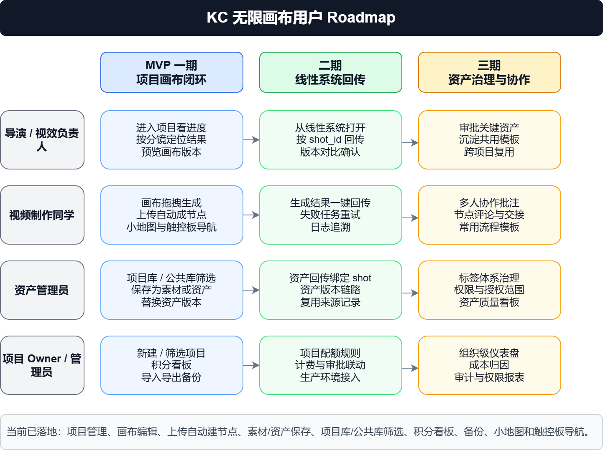

- drawio MCP 源文件：`drawio/mcp-user-roadmap.drawio`
- PNG 导出文件：`prd-screenshots/F-mcp-user-roadmap.png`
- 当前导出尺寸：`1442x1078`，按 drawio MCP 内容原比例导出，不放入窄表格单元格中压缩。

## 5. 当前线性系统流程

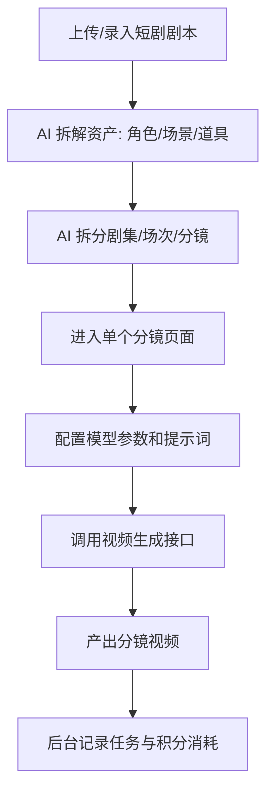

## 6. 目标协同流程

目标协同流程使用 drawio MCP 源文件维护，PRD 中插入导出的原比例 PNG。

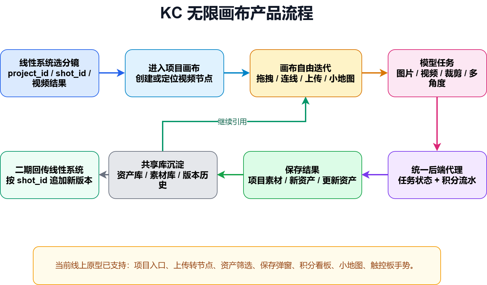

- drawio MCP 源文件：`drawio/mcp-product-flow.drawio`
- PNG 导出文件：`prd-screenshots/E-mcp-product-flow.png`
- 当前导出尺寸：`1482x868`，按 drawio MCP 内容原比例导出。

核心链路：

1. 用户在线性系统选择要精修的分镜视频或素材。
2. 系统带 `project_id`、`shot_id`、视频地址、封面和来源记录进入画布。
3. 画布创建或定位视频节点，由视频节点承接分镜信息。
4. 用户在画布中拖拽、连线、上传图片/视频/文本并继续迭代。
5. 图片生成、视频生成、裁剪、多角度等操作通过节点发起模型任务。
6. 后端统一代理模型调用，写入积分预扣、确认、失败返还等流水。
7. 用户将满意结果保存到项目素材、新建资产或更新已有资产版本。
8. 项目素材和正式资产回到共享库；二期再按 `shot_id` 回传线性分镜版本。

### 6.1 关键术语

| 术语 | 定义 | 当前原型状态 |
| --- | --- | --- |
| 项目画布 | 绑定一个短剧项目的无限画布空间，承载节点、连线、位置、缩放和保存状态 | 已用项目管理页和本地快照模拟 |
| 项目库 | 当前项目范围内可引用的角色、场景、道具资产 | 已在资产库面板提供筛选 |
| 公共库 | 可跨项目复用的公共角色、场景、道具资产 | 已在资产库面板提供筛选 |
| 项目素材 | 画布生成或上传后沉淀在当前项目下的图片/视频素材 | 已用素材库和保存弹窗模拟 |
| 正式资产 | 进入公司资产体系、可被线性系统和多个项目引用的角色/场景/道具 | 已用“保存为新资产/更新资产”模拟 |
| 画布备份 | 当前画布节点、连线、项目名、视口变换和资源引用的导入导出文件 | 已通过“导入/导出备份”入口提供 |
| `project_id` | 现有项目系统的项目唯一标识 | 已在节点和项目快照字段中模拟 |
| `shot_id` | 线性系统分镜唯一标识，用于从线性系统进入画布并二期回传新版本 | 已在视频节点 data 字段中模拟 |
| 积分流水 | 模型任务的预估、预扣、确认扣减、失败返还记录 | 已在节点和积分看板中模拟 |
| 触控板手势 | 双指滑动平移画布，双指捏合缩放画布 | 已实现，仍需验证输入框/滚动面板内的误拦截风险 |

## 7. 产品架构

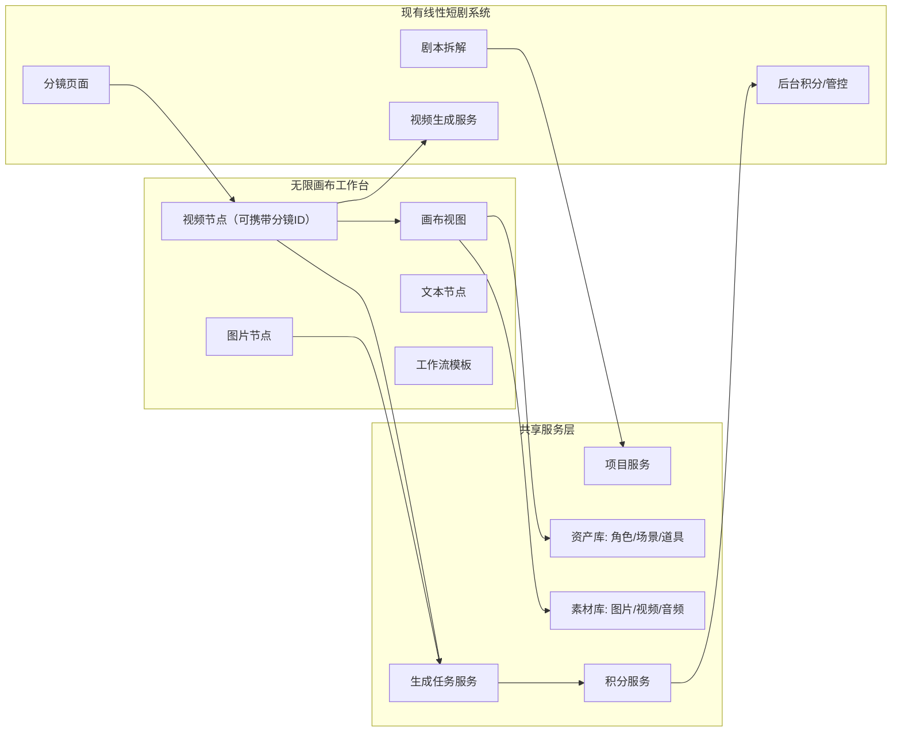

## 8. MVP 分期策略

### 8.1 一期 MVP：画布可用 + 分镜可跳转 + 积分可管控

一期目标是让业务人员真实使用画布完成分镜微调和素材迭代，同时保证成本可控。

| 优先级 | 模块 | 功能 | 简述 |
| --- | --- | --- | --- |
| P0 | 画布基础 | 无限画布操作 | 缩放、平移、拖拽、框选、复制、删除、连线 |
| P0 | 项目管理 | 项目画布管理 | 画布与现有项目绑定，支持创建、打开、保存、搜索、筛选和最近快照 |
| P0 | 分镜互通 | 分镜页跳转画布 | 线性分镜视频可一键导入画布，生成带分镜ID的视频节点 |
| P0 | 分镜信息承接 | 视频节点携带分镜信息 | 展示集、场、分镜描述、提示词、模型参数、结果视频 |
| P0 | 共享资产库 | 资产读取与引用 | 画布可搜索/拖入角色、场景、道具资产，支持项目库/公共库筛选 |
| P0 | 共享素材库 | 素材读取与保存 | 画布可读取素材，也可保存结果到项目素材库；图片/视频/文本上传自动转对应功能节点 |
| P0 | 视频生成 | 复用线性视频接口 | 视频节点调用现有视频生成服务 |
| P0 | 积分管控 | 统一预扣与流水 | 所有模型调用必须进入现有积分系统 |
| P0 | 生成任务 | 任务状态管理 | 生成中、成功、失败、失败原因、结果地址 |
| P0 | 图片工具 | 裁剪、多角度、上传 | 支持当前原型已有核心图片编辑能力 |
| P0 | 下载备份 | 结果下载/画布备份 | 图片、视频可下载，右上角下载和导入导出合并为统一画布备份入口 |
| P0 | 画布导航 | 小地图、整理画布、触控板手势 | 小地图定位、整理节点、缩放按钮、触控板双指平移与捏合缩放 |

### 8.2 二期：数据回传 + 批量生成 + 工作流复用

| 优先级 | 模块 | 功能 | 简述 |
| --- | --- | --- | --- |
| P1 | 分镜回传 | 画布结果回传线性分镜 | 将画布中选中的视频结果按 `shot_id` 追加为线性分镜新版本 |
| P1 | 资产版本 | 更新正式资产版本 | 有权限用户确认后写入正式资产库，并保留历史版本 |
| P1 | 批量能力 | 批量生图/生视频 | 基于多个带分镜信息的视频节点批量执行生成 |
| P1 | 专业工具 | 角色三视图/九宫格/25宫格 | 复刻 LibTV 高频视觉能力 |
| P1 | 工作流模板 | 保存与复用 | 将节点组合保存为项目或团队模板 |

### 8.3 三期：深度协同 + 生产增强

| 优先级 | 模块 | 功能 | 简述 |
| --- | --- | --- | --- |
| P2 | 双向同步 | 分镜/素材/资产深度互通 | 支持更完整的数据同步和冲突处理 |
| P2 | 时间线 | 粗剪与合成 | 多视频节点拼接、音频叠加、导出 |
| P2 | 协作 | 多人协同 | 评论、任务分配、权限、协同查看 |
| P2 | 高级成本 | 预算预警与审批 | 超预算提醒、模型限额、审批流 |
| 预留 | Agent Skill | 内部自动化扩展接口 | 先预留任务、节点、项目接口，不在当前阶段实现具体 Agent 能力包 |
| 观察 | 画布分区 | 自动分区/分镜组/场次组 | 暂不做，先让用户自行管理画布；后续根据真实使用需求再设计 |

### 8.4 当前原型实现状态

| 范围 | 当前代码/线上原型状态 | PRD 标记 |
| --- | --- | --- |
| 项目管理页 | 已精简为项目卡片 + 项目组/项目类型筛选 + 搜索 + 新建项目；卡片只展示项目名、导演组和最后快照状态 | 原型已实现 |
| 项目画布 | 已有节点、连线、拖拽、框选、保存、清空、返回项目列表；左侧不再保留“项目”按钮 | 原型已实现 |
| 上传自动建节点 | 侧边栏导入、画布拖放、右键菜单、本地上传和连线快速菜单会按图片/视频/文本生成对应节点 | 原型已实现 |
| 图片/视频节点结果工具条 | 已有上传、下载、保存、裁剪、多角度等入口，按钮文案已压缩，避免窄面板中文字竖排 | 原型已实现 |
| 项目库/公共库筛选 | 资产库面板已有“项目库/公共库/全部”筛选；资产放到画布后统一生成标准图片结果态节点 | 原型已实现 |
| 保存结果弹窗 | 已支持保存到项目素材、保存为新资产、更新已有资产版本的模拟流程 | 原型已实现 |
| 积分看板 | 顶部和侧边栏均有积分入口，项目维度/用户维度均为静态或本地数据 | 原型模拟 |
| 画布备份 | 右上角下载/导入/导出合并为一个“导入/导出备份”图标入口 | 原型已实现 |
| 小地图与导航 | 左下角已有小地图、整理画布、主题、缩放按钮和缩放百分比 | 原型已实现 |
| 触控板手势 | 原生 wheel 监听支持双指平移和捏合缩放 | 原型已实现，需补交互边界验证 |
| 线性系统真实跳转 | 当前只通过静态分镜数据模拟 `shot_id`、`project_id` 和视频结果 | 二期/接口接入 |
| 资产/素材真实同步 | 当前用本地数据模拟资产和素材写入 | 二期/接口接入 |

## 9. 一期 P0 详细功能需求

### 9.1 P0 范围总表

| 需求 ID | 模块 | 功能 | 优先级 | MVP 验收目标 |
| --- | --- | --- | --- | --- |
| P0-01 | 项目画布 | 项目画布管理 | P0 | 用户能以项目为单位打开、保存和继续编辑画布 |
| P0-02 | 画布基础 | 无限画布基础操作 | P0 | 用户能完成缩放、平移、拖拽、连线、复制、删除等基础操作 |
| P0-03 | 分镜互通 | 分镜页进入画布 | P0 | 用户能从线性分镜页一键进入项目画布并看到对应视频节点 |
| P0-04 | 分镜信息承接 | 视频节点携带分镜信息 | P0 | 视频节点能承载线性系统分镜ID、名称、描述、历史结果和后续迭代 |
| P0-05 | 共享资产库 | 角色/场景/道具资产调用 | P0 | 线性系统资产可在画布中搜索、拖入、引用和更新版本 |
| P0-06 | 共享素材库 | 项目素材管理 | P0 | 图片/视频素材可在画布和线性系统间共用 |
| P0-07 | 图片节点 | 图片生成与二次编辑 | P0 | 图片节点支持上传、引用、生成、裁剪、多角度、保存素材 |
| P0-08 | 视频节点 | 视频生成与结果沉淀 | P0 | 视频节点复用线性视频生成接口，并在画布中展示结果 |
| P0-09 | 积分管控 | 统一积分预扣与流水 | P0 | 所有模型任务都进入现有积分服务，不允许绕过 |
| P0-10 | 生成任务 | 任务状态与失败处理 | P0 | 用户能看到生成中、成功、失败和失败原因 |
| P0-11 | 下载备份 | 结果下载与画布备份 | P0 | 用户能下载图片/视频结果，并导入或导出当前画布备份 |
| P0-12 | 画布导航 | 小地图、整理画布、触控板手势 | P0 | 用户能快速定位节点、整理节点布局，并用触控板自然平移/缩放 |

### 9.2 P0-01 项目画布管理

| 字段 | 内容 |
| --- | --- |
| 功能说明 | 无限画布必须绑定现有项目体系，用户以项目为单位创建、打开、保存和管理画布 |
| 用户入口 | 线性系统项目详情页、分镜页面“画布中精修”按钮、画布工作台项目列表 |
| 核心操作 | 打开项目画布、自动创建默认画布、手动保存、自动保存、查看最后快照状态、按项目组筛选、按项目类型筛选、搜索项目 |
| 系统规则 | 一期默认一个项目对应一个主画布；暂不做自动分区、分镜组、场次组 |
| 数据范围 | 画布内节点、连线、节点位置、节点参数、引用资产、引用素材、生成结果和任务记录均归属于当前项目；入口页不展示分镜数、资产数等详细统计 |
| 权限规则 | 沿用现有项目权限；用户只能打开自己有权限访问的项目画布 |
| 保存规则 | 画布状态自动保存，用户也可以手动触发保存；保存失败时需要提示并允许重试 |
| 异常处理 | 无项目权限时禁止进入；画布加载失败时展示重试入口；自动保存失败时保留本地临时状态 |
| 原型截图 | S09 项目管理首页，S01 画布总览 |
| 验收标准 | 用户从项目或分镜进入画布后，能看到与该项目绑定的同一份画布数据；刷新页面后节点位置和连线不丢失 |

### 9.3 P0-02 无限画布基础操作

| 字段 | 内容 |
| --- | --- |
| 功能说明 | 提供类似 LibTV 的自由画布基础体验，让用户可以像整理白板一样摆放、连接和管理创作内容 |
| 支持节点 | 文本节点、图片节点、视频节点；资产和素材进入画布后按文件/资源类型转换成对应节点，其中视频节点可携带线性系统分镜信息 |
| 基础操作 | 缩放、平移、拖拽节点、框选、多选、复制、粘贴、删除、撤销预留、右键菜单、小地图定位、整理画布 |
| 连线规则 | 节点之间可通过连接端口建立引用关系；连线表示“上游节点作为下游节点的输入或参考” |
| 输入规则 | 图片、视频、文本、资产均可作为其他生成节点的入参；不同节点根据能力限制接受的输入类型 |
| 触控板规则 | 双指滑动平移画布；双指捏合以光标为中心缩放；缩放范围保持 `40% - 200%`；需要阻止浏览器默认缩放/前进后退 |
| 视觉规则 | 节点主体内容可随画布缩放；节点参数面板应尽量保持可编辑性，避免缩小时无法操作；过长按钮文案应简化，避免面板竖向拉长或文字挤压 |
| 右键菜单 | 画布右键支持新建节点、本地上传、粘贴；连线释放到空白处可快速创建下游节点；“首尾帧视频”入口改为“上传”，上传图片、视频、文本后自动生成对应节点 |
| 异常处理 | 连线不合法时不建立关系，并给出轻提示；删除节点时同步删除相关连线 |
| 原型截图 | S01 画布总览 |
| 验收标准 | 用户能在一个项目画布中完成至少 20 个节点的创建、移动、连线和删除，基础操作无明显卡顿 |

### 9.4 P0-03 分镜页进入画布

| 字段 | 内容 |
| --- | --- |
| 功能说明 | 在线性系统的分镜页面提供“画布中精修”入口，把已有分镜视频导入画布继续微调 |
| 用户入口 | 分镜页面右上角、生成结果区域、历史版本区域 |
| 用户操作 | 点击“画布中精修”后进入该项目主画布，并定位到对应视频节点 |
| 系统规则 | 如果该分镜已有对应视频节点，则打开并定位；如果没有，则在项目主画布中自动创建一个视频节点 |
| 导入内容 | 分镜描述、提示词、模型参数、参考资产、参考素材、历史图片、历史视频、当前选中视频结果 |
| 定位规则 | 一期不做自动分区，但需要把新建视频节点放在可见区域，避免用户进入画布后找不到 |
| 异常处理 | 分镜数据缺失时仍创建节点，但标记“数据不完整”；视频结果缺失时显示空结果状态 |
| 原型截图 | S02 分镜视频节点详情 |
| 验收标准 | 用户从分镜页进入画布后，能在 3 秒内看到对应视频节点、分镜ID和现有视频结果 |

### 9.5 P0-04 视频节点携带分镜信息

| 字段 | 内容 |
| --- | --- |
| 功能说明 | 一期不新增独立分镜节点，而是在视频节点上增加分镜信息。用户从线性分镜页进入画布时，系统自动创建或定位这个视频节点 |
| 节点内容 | 项目名、集数、场次、分镜编号、分镜ID、分镜描述、提示词、模型参数、参考资产、参考素材、当前视频结果 |
| 支持操作 | 拖拽、连线、复制、查看视频、发起视频生成、下载视频、打开线性分镜页 |
| 输入来源 | 线性分镜数据、上游图片节点、上游视频节点、角色/场景/道具资产、项目素材 |
| 输出结果 | 新图片节点、新视频节点、项目素材 |
| 一期规则 | 一期只保证线性分镜数据能带进画布；是否把画布结果回传到线性分镜，放到二期再做 |
| 展示规则 | 带有 `shot_id` 的视频节点需要展示“第几集/第几场/第几个分镜”，节点标题自动使用分镜名称，避免用户不知道这个视频来自哪个分镜 |
| 异常处理 | 如果分镜已被线性系统删除或无权限访问，节点保留但标记为“来源不可用” |
| 原型截图 | S02 分镜视频节点详情，S04 视频节点生成 |
| 验收标准 | 用户可以从线性分镜页进入画布，看到携带 `shot_id` 的视频节点，并基于它继续生成新视频 |

### 9.6 P0-05 共享资产库

| 字段 | 内容 |
| --- | --- |
| 功能说明 | 画布与线性系统共用角色、场景、道具资产库，避免两套资产割裂 |
| 用户入口 | 画布左侧资产面板、节点参考素材选择器、节点工具条“保存到资产库” |
| 资产类型 | 角色、场景、道具，后续可扩展风格、镜头、音色等资产类型 |
| 支持操作 | 搜索、按项目库/公共库/全部筛选、按角色/场景/道具筛选、预览、放到画布、引用到节点、保存为新资产、更新资产版本 |
| 引用规则 | 放到画布后生成标准图片结果态节点，功能和普通有图图片节点一致；作为其他节点输入时使用 `asset_id` 引用 |
| 写入规则 | 画布生成结果默认保存到项目素材库；有权限用户手动选择后才写入正式资产库 |
| 版本规则 | 暂不设置审核流程；资产更新必须生成历史版本记录，支持查看来源画布、来源节点、更新人和更新时间 |
| 权限规则 | 沿用现有资产库权限；无写入权限的用户只能引用和保存到项目素材 |
| 异常处理 | 资产加载失败时展示空态和重试；资产已删除时保留节点但标记来源失效 |
| 原型截图 | S03 资产库放到画布，S14 公共库筛选态，S16 资产标准图片节点，S06 保存到素材/资产库 |
| 验收标准 | 线性系统已有资产可在画布中被搜索、拖入和引用；有权限用户可把画布结果更新为资产新版本 |

### 9.7 P0-06 共享素材库

| 字段 | 内容 |
| --- | --- |
| 功能说明 | 图片、视频、音频素材在画布和线性系统中共用，重点支持项目素材沉淀 |
| 用户入口 | 左侧素材库、画布右键菜单、节点本地上传按钮、连线快速菜单“上传”、结果节点工具条 |
| 素材范围 | 项目素材、公共素材、个人素材、团队素材；一期优先项目素材、公共素材和本地上传 |
| 支持操作 | 上传、搜索、预览、拖入、复制、删除、下载、保存生成结果、右键“保存素材/复制/删除” |
| 保存规则 | 画布生成结果默认可保存到项目素材库；保存后线性系统的视频节点可调用 |
| 引用规则 | 图片素材进入画布后成为标准图片结果态节点；视频素材生成视频节点；文本素材生成文本/创意描述节点；均支持继续连线和二次操作 |
| 删除规则 | 删除画布节点不等于删除素材库源文件；从素材库删除需二次确认并受权限限制 |
| 异常处理 | 上传格式不支持时提示；大文件上传失败时允许重试；素材不存在时展示失效状态 |
| 原型截图 | S10 资产库与素材库，S06 保存到素材/资产库 |
| 验收标准 | 画布生成的视频结果可保存到项目素材，并能被线性视频节点调用 |

### 9.8 P0-07 图片节点

| 字段 | 内容 |
| --- | --- |
| 功能说明 | 图片节点用于承载本地上传、素材库引用、模型生成、裁剪结果和多角度结果 |
| 用户入口 | 画布右键新建、左侧添加节点、本地上传、统一“上传”入口、资产/素材放到画布、视频节点生成结果 |
| 输入 | 提示词、参考图片、角色/场景/道具资产、上游图片/视频截图、画幅、模型参数 |
| 输出 | 图片结果、图片版本、项目素材、正式资产版本 |
| 支持工具 | 本地上传、图片生成、裁剪、多角度、下载、放大查看、保存到项目素材、保存为新资产、更新资产版本 |
| 裁剪规则 | 裁剪画幅只能使用节点支持的画幅比例；裁剪后生成新的标准图片节点 |
| 多角度规则 | 多角度结果默认以完整场景为目标，不只处理人物或局部主体 |
| 结果规则 | 任意来源进入画布的图片都应等同于新建图片节点后上传图片，可继续编辑 |
| 异常处理 | 图片读取失败时显示占位；跨域图片无法裁剪时提示用户先保存为本地素材 |
| 原型截图 | S01 画布总览，S06 保存到素材/资产库 |
| 验收标准 | 用户可以围绕一张图片完成上传、裁剪、多角度、保存素材的完整闭环 |

### 9.9 P0-08 视频节点

| 字段 | 内容 |
| --- | --- |
| 功能说明 | 视频节点复用现有线性系统视频生成能力，并在画布中沉淀视频结果和每次修改记录 |
| 用户入口 | 画布右键新建、统一“上传”入口、带分镜信息的视频节点发起生成、图片节点转视频、素材库视频拖入 |
| 输入 | 提示词、参考图片、参考视频、资产 ID、素材 ID、分镜上下文、模型参数 |
| 输出 | 视频 URL、封面图、任务状态、积分消耗、项目素材；如果节点带有 `shot_id`，需要保留后续回传所需的分镜上下文 |
| 接口策略 | 一期不新建一套视频生成服务，复用线性系统已有视频生成接口 |
| 生成流程 | 预估积分 -> 预扣积分 -> 创建生成任务 -> 调用线性视频接口 -> 轮询/接收结果 -> 确认扣减 -> 写入节点 |
| 结果操作 | 播放、暂停、放大查看、下载、保存到项目素材；追加为线性分镜新版本放到二期实现 |
| 异常处理 | 生成失败时展示失败原因；积分返还或解冻；允许用户复制参数后重试 |
| 原型截图 | S04 视频节点生成，S05 积分预估与扣减 |
| 验收标准 | 用户在画布中点击生成后，可看到任务状态和最终视频节点，后台能看到对应积分流水 |

### 9.10 P0-09 积分管控

| 字段 | 内容 |
| --- | --- |
| 功能说明 | 画布所有模型调用统一接入现有积分服务，保证项目成本可控 |
| 核心规则 | 预估消耗、预扣积分、任务执行、确认扣减、失败返还或解冻 |
| 统计维度 | 项目、导演组、用户、模型、任务类型、节点、分镜、资产、素材 |
| 前台展示 | 生成按钮附近展示预估积分；余额或额度不足时禁止发起任务 |
| 后台展示 | 复用现有后台，按项目、导演组、业务人员、模型、任务类型查看消耗 |
| 最低要求 | 不允许绕过积分服务直接调用模型；无积分流水的任务视为异常任务 |
| 异常处理 | 预扣失败禁止生成；任务超时按失败处理；结果生成但扣减失败时进入异常待处理状态 |
| 原型截图 | S05 积分预估与扣减，S08 后台积分看板 |
| 验收标准 | 后台可查看画布产生的每一笔模型消耗流水，并能追溯到项目、用户、节点和分镜 |

### 9.11 P0-10 生成任务状态

| 字段 | 内容 |
| --- | --- |
| 功能说明 | 画布需要统一展示图片、视频、文本分析等生成任务状态 |
| 任务状态 | 待预扣、排队中、生成中、成功、失败、已取消、异常待处理 |
| 前台展示 | 节点内显示加载态、进度或状态文案；失败时显示失败原因和重试入口 |
| 数据记录 | 任务 ID、发起人、节点 ID、分镜 ID、模型、参数、积分记录、结果地址、错误信息 |
| 操作支持 | 取消任务预留、失败重试、复制参数、查看任务详情 |
| 异常处理 | 接口超时、模型失败、积分失败、结果地址失效都需要可被记录和展示 |
| 原型截图 | S04 视频节点生成，S05 积分预估与扣减 |
| 验收标准 | 用户不需要打开开发者工具，也能知道任务是否成功、为什么失败、是否扣费 |

### 9.12 P0-11 下载备份

| 字段 | 内容 |
| --- | --- |
| 功能说明 | 在一期未完全打通所有线性系统数据前，保证业务结果可以被下载、迁移和复盘 |
| 下载范围 | 图片结果、视频结果、节点内参考素材 |
| 导出范围 | 当前项目画布数据，包括节点、连线、位置、参数、引用关系和必要的结果地址 |
| 用户入口 | 节点工具条、素材库右键菜单、顶部工具栏“导入/导出备份” |
| 入口规则 | 右上角不再保留独立“下载备份”和“项目”文字按钮；下载备份、导入、导出统一收敛到备份图标入口 |
| 系统规则 | 下载素材不改变资产库和素材库状态；导出文件用于备份或交付给研发排查 |
| 异常处理 | 下载失败时打开原始地址；导出失败时提示重试；缺失资源在导出文件中标记失效 |
| 原型截图 | S12 画布备份弹窗，S01 画布总览，S06 保存到素材/资产库 |
| 验收标准 | 用户可以把核心图片/视频结果下载到本地，并能导出当前画布项目文件 |

### 9.13 P0-12 画布导航与手势

| 字段 | 内容 |
| --- | --- |
| 功能说明 | 提供更接近专业创作工具的画布导航体验，降低节点多时的定位成本 |
| 用户入口 | 画布左下角导航控制区、触控板手势、缩放按钮、小地图、整理画布按钮 |
| 支持操作 | 小地图展开/收起、点击小地图定位视野、整理当前节点布局、放大/缩小、查看当前缩放百分比、切换明暗主题 |
| 触控板交互 | 双指滑动平移画布；双指捏合缩放画布；缩放锚点为光标位置 |
| 保留交互 | 空格拖动画布、中键拖动画布、缩放按钮、小地图操作继续可用 |
| 系统规则 | 手势事件应限制在画布容器内；输入框、文本域、下拉框等可滚动/可编辑区域不应被画布滚轮监听误伤 |
| 性能规则 | 高频滚轮/手势事件需要合并到 `requestAnimationFrame`，避免大画布逐事件重渲染 |
| 验收标准 | 触控板双指滑动、捏合缩放、小地图定位、整理画布均可用；节点文本输入和面板滚动不应触发画布误移动 |

### 9.14 PRD 与当前项目实际差异

| 模块 | PRD 期望 | 当前项目实际情况 | 处理建议 |
| --- | --- | --- | --- |
| 线性系统跳转 | 从真实线性分镜页带 `project_id`、`shot_id`、视频结果进入画布 | 原型使用静态项目和静态分镜节点模拟，尚未接真实线性页面 | PRD 标为 P0 目标，研发排期需拆接口接入任务 |
| 分镜视频节点 | 分镜信息由视频节点承接，不新增独立分镜节点 | `TEXT_TO_VIDEO` 已承载分镜字段；`START_END_TO_VIDEO` 节点组件仍保留“首尾帧生视频”内部类型 | PRD 中明确“入口替换为上传/视频节点，不代表内部节点类型删除” |
| 资产/素材写入 | 保存到项目素材、新建资产、更新资产版本写入统一后端 | 当前保存弹窗和资产库为本地/静态数据演示 | PRD 标为原型模拟，二期补后端资产版本接口 |
| 积分管控 | 所有模型任务必须进入现有积分服务 | 当前节点展示预估/预扣/扣减状态，积分看板为本地聚合模拟 | 接后端前不能用于真实计费验收 |
| 触控板手势 | 输入框、文本域、下拉框、可滚动面板内滚动不应触发画布移动 | 当前原生 `wheel` 监听挂在画布容器并直接 `preventDefault`，存在子元素滚动被提前拦截的风险 | 需要在实现中增加 `closest('input, textarea, select, [contenteditable], .custom-scrollbar')` 等放行规则 |
| 截图规范 | PRD 内截图必须保持原页面完整比例 | `feishu-prd-v0.2.xml` 仍保留旧小宽度图片；v0.4 Markdown 已使用独立原比例图片块 | 后续同步飞书时只使用 v0.4 或更新版本 |

## 10. 数据字段定义草案

本章节用于技术对齐，不要求一期完全按该结构新建表，但前后端接口返回字段应尽量向该结构靠齐，避免后续重构时再次转换。

### 10.1 项目画布字段

```json
{
  "canvas_id": "canvas_001",
  "project_id": "project_001",
  "canvas_name": "《短剧项目A》主画布",
  "status": "active",
  "viewport": {
    "x": 0,
    "y": 0,
    "zoom": 1
  },
  "node_count": 18,
  "edge_count": 24,
  "created_by": "user_001",
  "updated_by": "user_002",
  "created_at": "2026-06-01T00:00:00+08:00",
  "updated_at": "2026-06-01T00:10:00+08:00"
}
```

| 字段 | 必填 | 说明 |
| --- | --- | --- |
| `canvas_id` | 是 | 画布唯一 ID |
| `project_id` | 是 | 绑定现有项目 ID |
| `viewport` | 否 | 用户最后查看画布的位置和缩放 |
| `status` | 是 | `active` / `archived` |

### 10.2 画布节点通用字段

```json
{
  "node_id": "node_001",
  "canvas_id": "canvas_001",
  "project_id": "project_001",
  "node_type": "video",
  "title": "第1集-第2场-分镜3",
  "position": { "x": 120, "y": 80 },
  "size": { "width": 560, "height": 360 },
  "source": "linear_pipeline",
  "source_ref_id": "shot_001",
  "data": {},
  "created_by": "user_001",
  "updated_by": "user_001",
  "created_at": "2026-06-01T00:00:00+08:00",
  "updated_at": "2026-06-01T00:00:00+08:00"
}
```

| `node_type` 枚举 | 说明 |
| --- | --- |
| `image` | 图片节点，承载生图结果、本地上传、裁剪结果、多角度结果和资产库图片 |
| `video` | 视频节点，承载生视频结果、本地上传视频和带 `shot_id` 的分镜视频 |
| `text` | 文本/创意描述节点，承载用户输入文本、本地文本上传、图片/视频分析结果和剧本资产表 |
| `asset` | 后端资产对象类型；一期进入画布后不单独展示为资产节点，而是转换为标准图片节点并保留 `source=asset_library` |
| `material` | 后端素材对象类型；进入画布后按素材类型转换为图片、视频或文本节点 |

### 10.3 视频节点携带分镜信息 data 字段

```json
{
  "episode_id": "ep_001",
  "episode_no": 1,
  "scene_id": "scene_001",
  "scene_no": 2,
  "shot_id": "shot_001",
  "shot_no": 3,
  "shot_description": "男主推门进入废弃仓库，看到远处闪烁的蓝色光源。",
  "prompt": "当前视频生成提示词",
  "negative_prompt": "负面提示词",
  "model_config": {
    "model_id": "linear_video_model",
    "duration": "5s",
    "ratio": "16:9",
    "resolution": "1080p"
  },
  "reference_asset_ids": ["asset_role_001", "asset_scene_001"],
  "reference_material_ids": ["mat_img_001"],
  "current_version_id": "shot_version_003",
  "versions": [
    {
      "version_id": "shot_version_003",
      "type": "video",
      "url": "https://example.com/video.mp4",
      "cover_url": "https://example.com/cover.png",
      "task_id": "task_001",
      "created_at": "2026-06-01T00:00:00+08:00"
    }
  ]
}
```

### 10.4 资产引用字段

```json
{
  "asset_id": "asset_role_001",
  "asset_type": "role",
  "asset_name": "男主-陆沉",
  "asset_scope": "project",
  "current_version_id": "asset_version_004",
  "preview_url": "https://example.com/role.png",
  "source": "asset_library",
  "can_update": true,
  "metadata": {
    "gender": "male",
    "age_range": "25-30",
    "description": "角色资产描述"
  }
}
```

| `asset_type` 枚举 | 说明 |
| --- | --- |
| `role` | 角色资产 |
| `scene` | 场景资产 |
| `prop` | 道具资产 |

| `asset_scope` 枚举 | 说明 |
| --- | --- |
| `project` | 当前项目库资产，只在当前项目或授权项目内优先展示 |
| `public` | 公共库资产，可跨项目引用 |

### 10.5 素材字段

```json
{
  "material_id": "mat_001",
  "project_id": "project_001",
  "material_type": "video",
  "material_scope": "project",
  "name": "分镜3-优化版视频",
  "url": "https://example.com/result.mp4",
  "cover_url": "https://example.com/result-cover.png",
  "source": "canvas_generation",
  "source_canvas_id": "canvas_001",
  "source_node_id": "node_001",
  "source_task_id": "task_001",
  "created_by": "user_001",
  "created_at": "2026-06-01T00:00:00+08:00"
}
```

| `material_type` 枚举 | 说明 |
| --- | --- |
| `image` | 图片素材 |
| `video` | 视频素材 |
| `audio` | 音频素材 |
| `text` | 文本素材或提示词素材 |

| `material_scope` 枚举 | 说明 |
| --- | --- |
| `project` | 当前项目素材 |
| `public` | 公共素材 |
| `personal` | 个人素材，后续扩展 |
| `team` | 团队素材，后续扩展 |

### 10.6 生成任务字段

```json
{
  "task_id": "task_001",
  "project_id": "project_001",
  "canvas_id": "canvas_001",
  "node_id": "node_001",
  "shot_id": "shot_001",
  "task_type": "video_generation",
  "status": "running",
  "model_vendor": "internal_video_service",
  "model_id": "linear_video_model",
  "input": {
    "prompt": "视频提示词",
    "asset_ids": ["asset_role_001"],
    "material_ids": ["mat_img_001"],
    "params": {}
  },
  "output": {
    "urls": [],
    "cover_url": ""
  },
  "credit_record_id": "credit_001",
  "error_code": "",
  "error_message": "",
  "created_by": "user_001",
  "created_at": "2026-06-01T00:00:00+08:00",
  "completed_at": ""
}
```

| `status` 枚举 | 说明 |
| --- | --- |
| `pending_credit` | 待积分预扣 |
| `queued` | 排队中 |
| `running` | 生成中 |
| `succeeded` | 成功 |
| `failed` | 失败 |
| `cancelled` | 已取消 |
| `credit_exception` | 积分异常待处理 |

### 10.7 积分流水字段

```json
{
  "credit_record_id": "credit_001",
  "project_id": "project_001",
  "director_group_id": "group_001",
  "user_id": "user_001",
  "canvas_id": "canvas_001",
  "node_id": "node_001",
  "shot_id": "shot_001",
  "task_id": "task_001",
  "task_type": "video_generation",
  "model_vendor": "internal_video_service",
  "model_id": "linear_video_model",
  "estimated_credit": 10,
  "reserved_credit": 10,
  "actual_credit": 9,
  "status": "confirmed",
  "created_at": "2026-06-01T00:00:00+08:00",
  "completed_at": "2026-06-01T00:01:00+08:00"
}
```

| `status` 枚举 | 说明 |
| --- | --- |
| `reserved` | 已预扣 |
| `confirmed` | 已确认扣减 |
| `released` | 已返还或解冻 |
| `failed` | 扣费失败 |
| `exception` | 异常待人工处理 |

### 10.8 画布连线字段

```json
{
  "edge_id": "edge_001",
  "canvas_id": "canvas_001",
  "project_id": "project_001",
  "source_node_id": "node_asset_001",
  "target_node_id": "node_video_001",
  "edge_type": "reference",
  "created_by": "user_001",
  "created_at": "2026-06-01T00:00:00+08:00"
}
```

| `edge_type` 枚举 | 说明 |
| --- | --- |
| `reference` | 上游作为参考输入 |
| `derive` | 下游由上游生成或编辑得到 |
| `version` | 同一对象的版本关系 |

### 10.9 权限矩阵

| 角色 | 查看项目画布 | 编辑节点/连线 | 发起模型任务 | 保存项目素材 | 新建/更新正式资产 | 查看积分看板 | 导入/导出备份 |
| --- | --- | --- | --- | --- | --- | --- | --- |
| 导演组业务人员 | 是，本组项目 | 是，本组项目 | 是，受项目额度限制 | 是 | 否，需资产管理员 | 查看本项目 | 导出本项目 |
| 分镜/视频生成专员 | 是，授权项目 | 是，授权项目 | 是，受个人和项目额度限制 | 是 | 否，需资产管理员 | 查看本人和授权项目 | 导出授权项目 |
| 资产管理员 | 是，授权项目 | 可编辑资产相关节点 | 可选 | 是 | 是 | 查看资产相关项目 | 导出授权项目 |
| 项目负责人 | 是，负责项目 | 可编辑 | 可选 | 是 | 可申请或授权后更新 | 查看负责项目 | 导入/导出负责项目 |
| 后台管理员 | 是，全部或按组织授权 | 可配置 | 可配置 | 可配置 | 可配置 | 查看全部 | 管理全部备份策略 |

### 10.10 埋点与指标

| 事件名 | 触发时机 | 关键属性 |
| --- | --- | --- |
| `canvas_project_open` | 打开项目画布 | `project_id`、`director_group`、`source` |
| `node_create` | 新建、拖入或上传自动生成节点 | `project_id`、`node_type`、`source`、`file_type` |
| `node_upload_create` | 通过统一上传入口创建节点 | `project_id`、`node_type`、`file_type`、`entry`、`connected_from_node_id` |
| `asset_drag_to_canvas` | 从项目库/公共库拖入资产 | `project_id`、`asset_id`、`asset_type`、`scope` |
| `generation_start` | 发起图片/视频/文本任务 | `project_id`、`node_id`、`model_id`、`estimated_credit` |
| `generation_result` | 生成成功或失败 | `project_id`、`node_id`、`task_id`、`status`、`actual_credit` |
| `save_result_confirm` | 确认保存到项目素材或资产库 | `project_id`、`node_id`、`save_mode`、`target_asset_id` |
| `credit_dashboard_open` | 打开积分看板 | `project_id`、`entry` |
| `backup_export` | 导出画布备份 | `project_id`、`node_count`、`edge_count` |
| `wheel_pan_zoom` | 触控板平移或缩放 | `project_id`、`gesture_type`、`scale_before`、`scale_after` |

### 10.11 接口依赖清单

| 依赖 | 一期最低要求 | 当前原型替代方式 |
| --- | --- | --- |
| 项目列表/项目详情 | 返回项目基础信息、项目组、权限、统计数据 | 本地 `DEMO_PROJECTS` 和 `localStorage` |
| 线性分镜详情 | 支持按 `shot_id` 获取分镜描述、历史视频、模型参数和回跳链接 | 静态视频节点 data 字段 |
| 资产库查询 | 支持按项目库/公共库、角色/场景/道具、关键词检索 | 静态资产数组和侧边栏筛选 |
| 素材库查询/写入 | 支持保存项目素材、读取项目素材、删除和权限校验；本地上传图片/视频/文本需返回可引用素材地址 | 本地历史素材和保存弹窗模拟 |
| 模型任务代理 | 统一发起任务、查询状态、返回结果 URL | 节点内模拟状态和示例视频/图片 |
| 积分服务 | 支持预估、预扣、确认扣减、失败返还和流水查询 | 节点 credit 字段和本地聚合看板 |
| 画布快照服务 | 保存节点、连线、视口、项目名、版本和更新时间 | 浏览器本地存储与 `.flow` 备份 |

## 11. 正式前端选型建议

### 11.1 当前原型的定位

当前 `tapnow-base` 原型适合继续用于：

- 验证无限画布的核心交互。
- 验证节点参数面板和工具菜单。
- 验证本地上传、裁剪、多角度、素材库等体验。
- 生成产品方案所需的原型截图。
- 给前端工程师参考节点 UI 和业务交互。

当前原型不建议作为正式生产系统完整底座直接长期演进，因为它的画布事件系统是轻量自研，后续面对复杂多选、分组、撤销重做、大规模节点、嵌套工作流和性能优化时维护成本较高。

### 11.2 正式工程建议

正式前端建议采用：

```text
React + TypeScript + React Flow / xyflow + 现有业务组件复用
```

原因：

- React Flow 原生支持节点、连线、缩放、平移和自定义节点，可以减少基础画布交互的自研成本。
- 后续如果需要分镜组、场次组、工作流模板，React Flow 已经有较成熟的父子节点和分组能力，正式开发不需要从零实现。
- 前端工程师可把当前原型中的节点 UI、参数面板、素材库、工具栏设计迁移到 React Flow 自定义节点中。
- 可以减少正式工程在基础画布交互上的自研成本。

## 12. 原型适配与截图计划

为了支持 PRD 和评审材料，当前线上原型需要按正式方案做一次“展示型适配”。这次适配不是要把所有真实后端接口一次性接完，而是让业务方和技术同学打开原型后，能直观看到 MVP 版本要做成什么样、每个功能入口在哪里、用户点击后会发生什么。

原型改造分两类：

- **真实可操作能力**：沿用当前原型已有能力，例如画布拖拽、连线、上传、图片裁剪、多角度编辑、素材预览、下载。
- **展示型模拟能力**：先用静态演示数据模拟，例如项目列表、带分镜信息的视频节点数据、资产库数据、积分预估、后台积分看板。后续正式开发时替换为真实接口。

### 12.1 原型适配任务

| 任务 ID | 原型任务 | 类型 | 对应 PRD 功能 | 说明 |
| --- | --- | --- | --- | --- |
| UI-01 | 项目入口与项目状态展示 | 静态演示数据 + 真实导航 | P0-01 | 项目管理页精简展示项目名、导演组和最后快照；画布顶部显示当前项目名、项目编号、保存状态，并用左侧箭头返回项目列表 |
| UI-02 | 带分镜信息的视频节点 | 静态演示数据 + 真实节点交互 | P0-03 / P0-04 | 不新增独立分镜节点；在视频节点上展示集、场、分镜编号、`shot_id`、分镜描述、历史视频结果和“生成新版”按钮 |
| UI-03 | 线性跳转模拟页 | 静态演示数据 | P0-03 | 做一个简化的“线性分镜页”入口，用户点击“画布中精修”后进入画布并定位对应视频节点 |
| UI-04 | 资产库面板 | 静态演示数据 + 真实拖入 | P0-05 | 左侧资产库区分项目库/公共库/全部和角色/场景/道具，支持搜索、预览、放到画布；资产进入画布后使用标准图片结果态节点 |
| UI-05 | 素材库面板升级 | 静态演示数据 + 复用已有素材库 | P0-06 | 当前素材库补充项目素材、公共素材、上传素材分类，支持右键保存素材、复制、删除 |
| UI-06 | 图片节点结果工具条 | 真实交互 + 模拟保存 | P0-07 | 图片有结果后，节点上方显示多角度、裁剪、上传、保存、下载、放大；按钮文案保持短，避免竖排挤压 |
| UI-07 | 视频节点生成面板 | 模拟接口 + 真实任务状态展示 | P0-08 / P0-10 | 视频节点展示提示词、参考素材、预估积分、生成按钮、生成中状态、成功视频结果、失败提示 |
| UI-08 | 积分预估与扣减提示 | 静态演示数据 | P0-09 | 在生成按钮旁展示“预计消耗 X 积分”，点击生成后展示“已预扣/已确认扣减/失败返还”状态 |
| UI-09 | 保存到项目素材/更新资产弹窗 | 静态演示数据 | P0-05 / P0-06 | 用户点击保存时弹出选择：保存到项目素材、保存为新资产、更新已有资产版本 |
| UI-10 | 后台积分看板截图页 | 静态演示数据 | P0-09 | 做一个独立演示页或弹窗，用静态表格展示项目、导演组、人员、模型消耗 |
| UI-11 | 任务失败态 | 静态演示数据 | P0-10 | 视频/图片节点支持展示失败原因、重试按钮、复制参数按钮 |
| UI-12 | 画布备份入口 | 复用已有能力 | P0-11 | 顶部导入/导出和下载合并为“导入/导出备份”图标入口，下载图片/视频仍保留在结果节点工具条 |
| UI-13 | 画布导航控制区 | 真实交互 | P0-02 / P0-12 | 左下角新增小地图、整理画布、主题、缩放百分比、放大/缩小 |
| UI-14 | 触控板手势 | 真实交互 | P0-02 / P0-12 | 双指滑动平移，捏合缩放，阻止浏览器默认页面缩放/前进后退 |
| UI-15 | 统一上传入口 | 真实交互 | P0-02 / P0-06 / P0-07 / P0-08 | 右键菜单和连线快速菜单中的“首尾帧视频”入口替换为“上传”，按文件类型创建图片、视频或文本节点 |

### 12.2 具体原型任务说明

#### UI-01 项目入口与项目状态展示

| 项 | 说明 |
| --- | --- |
| 要做什么 | 在画布顶部左侧增加项目信息区域，让用户知道当前正在编辑哪个短剧项目 |
| 页面位置 | 当前标题区域，替换或扩展现有“KC画布 MVP 试用项目” |
| 展示内容 | 项目管理页展示项目名、导演组、最后快照状态；画布顶部展示项目名、项目编号、导演组、保存状态 |
| 用户操作 | 点击项目卡进入画布；画布顶部项目名左侧箭头返回项目列表；点击“返回线性系统”模拟回到原分镜页面 |
| 状态示例 | `已保存`、`保存中`、`保存失败，点击重试` |
| 原型数据 | 使用静态演示项目：`《隐秘回响》 / 项目ID KC-DRAMA-001 / A组导演组` |
| 截图用途 | 证明画布是项目制工作台，不是一个孤立画板 |

#### UI-02 带分镜信息的视频节点

| 项 | 说明 |
| --- | --- |
| 要做什么 | 复用视频节点，不新增单独的分镜节点。线性系统传入分镜数据时，视频节点自动带上分镜信息 |
| 节点标题 | `第1集 第2场 分镜03` |
| 节点主体 | 上半部分展示当前视频封面或视频播放器；下半部分展示分镜描述、提示词摘要、参考资产缩略图和 `shot_id` |
| 节点按钮 | `打开线性分镜页`、`生成新版视频`、`保存到项目素材`、`下载视频` |
| 用户操作 | 用户可以把角色资产、场景资产、图片节点连到这个视频节点，作为生成参考 |
| 结果展示 | 点击生成后，节点显示生成中；成功后展示新视频结果；失败后显示失败原因 |
| 原型数据 | 使用静态分镜描述和静态视频封面；生成可先用模拟 loading 和固定视频/图片结果 |
| 截图用途 | 说明“线性分镜页如何进入画布精修” |

#### UI-03 线性跳转模拟页

| 项 | 说明 |
| --- | --- |
| 要做什么 | 在原型里做一个简化入口，用于模拟用户从现有线性分镜页面跳到无限画布 |
| 页面内容 | 项目名、集/场/分镜信息、当前生成视频、按钮“画布中精修” |
| 用户操作 | 点击“画布中精修”后进入画布，并自动定位到带分镜信息的视频节点 |
| 原型实现 | 可以是一个弹窗、侧栏入口或独立 demo 页面，不要求还原完整线性系统 |
| 截图用途 | 说明两个系统不是割裂的，分镜可以进入画布继续编辑 |

#### UI-04 资产库面板

| 项 | 说明 |
| --- | --- |
| 要做什么 | 在左侧侧栏新增“资产库”，用户可以找到已有角色、场景、道具，并明确区分当前项目资产与公共资产 |
| 一级分类 | `角色`、`场景`、`道具` |
| 库范围筛选 | `全部`、`项目库`、`公共库`；项目库表示当前项目资产，公共库表示所有项目可共用资产 |
| 资产卡片 | 缩略图、资产名称、资产类型、当前版本、更新时间 |
| 用户操作 | 搜索资产、点击预览、切换项目库/公共库、放到画布、右键保存/复制引用 |
| 拖入结果 | 放到画布后生成标准图片结果态节点，节点显示资产名和预览图，并拥有多角度、裁剪、上传、保存、下载、放大等工具 |
| 原型数据 | 使用 3 个角色、2 个场景、2 个道具静态演示数据 |
| 截图用途 | 说明画布与现有资产库共用同一批资产 |

#### UI-05 素材库面板升级

| 项 | 说明 |
| --- | --- |
| 要做什么 | 把当前素材库从“生成结果集合”升级成更接近业务的项目素材入口 |
| 分类 | `项目素材`、`公共素材`、`本地上传`、`生成结果` |
| 素材卡片 | 图片/视频缩略图、名称、来源、创建时间 |
| 用户操作 | 预览、拖入画布、右键“保存素材/复制/删除”、保存到本地、下载 |
| 删除规则 | 原型里只删除画布展示数据；正式系统删除素材库源文件需要权限和二次确认 |
| 截图用途 | 展示画布生成结果如何沉淀为项目素材 |

#### UI-06 图片节点结果工具条

| 项 | 说明 |
| --- | --- |
| 要做什么 | 图片节点有结果后，隐藏下方生成参数面板，在节点上方展示二次处理工具条 |
| 工具按钮 | `多角度`、`裁剪`、`上传`、`保存`、`下载`、`放大查看` |
| 文案规则 | 工具条按钮尽量使用 2-4 字短文案，例如“多角度”“裁剪”“上传”“保存”，避免在窄工具条内竖排 |
| 用户操作 | 用户点击裁剪/多角度继续生成新图片节点；点击保存则弹出保存选择 |
| 关键规则 | 已有图片结果时，节点重点是二次优化，不再默认展示生图输入框 |
| 截图用途 | 展示图片节点如何支持多轮迭代和资产沉淀 |

#### UI-07 视频节点生成面板

| 项 | 说明 |
| --- | --- |
| 要做什么 | 视频节点展示复用线性视频生成接口的操作入口 |
| 面板内容 | 提示词输入框、参考素材缩略图、模型参数、预估积分、生成按钮 |
| 生成前 | 用户可以编辑提示词、选择参考图/视频、查看预估积分 |
| 生成中 | 节点显示 loading、任务状态文案，如“视频生成中，预计 1-3 分钟” |
| 生成后 | 节点展示视频播放器、下载、保存到项目素材；如果该视频节点带有 `shot_id`，需要继续保留这个 `shot_id` 方便二期回传 |
| 失败态 | 展示失败原因、重试、复制参数 |
| 原型实现 | 可以先用模拟任务状态，不要求真实调用线性视频接口 |
| 截图用途 | 展示从填写提示词到生成视频结果的完整过程 |

#### UI-08 积分预估与扣减提示

| 项 | 说明 |
| --- | --- |
| 要做什么 | 让用户在点击生成前就知道预计消耗多少积分 |
| 展示位置 | 节点生成按钮旁、生成任务状态区域、后台积分看板 |
| 展示文案 | `预计消耗 10 积分`、`已预扣 10 积分`、`生成成功，实际扣减 9 积分`、`生成失败，积分已返还` |
| 异常态 | 余额不足时生成按钮置灰，提示“项目额度不足，请联系管理员” |
| 原型实现 | 使用静态积分数据和模拟状态切换 |
| 截图用途 | 证明一期已经考虑成本管控 |

#### UI-09 保存到项目素材/更新资产弹窗

| 项 | 说明 |
| --- | --- |
| 要做什么 | 用户对满意的图片/视频结果，可以选择保存位置 |
| 触发入口 | 图片节点工具条、视频节点工具条、素材右键菜单 |
| 弹窗选项 | `保存到项目素材`、`保存为新资产`、`更新已有资产版本` |
| 表单字段 | 名称、类型、关联角色/场景/道具、备注 |
| 历史规则 | 更新已有资产版本时，文案提示“会保留历史版本，不覆盖旧结果” |
| 原型实现 | 先模拟保存成功提示，不要求真实写入资产库 |
| 截图用途 | 展示画布结果如何回到资产/素材体系 |

#### UI-10 后台积分看板截图页

| 项 | 说明 |
| --- | --- |
| 要做什么 | 为 PRD 截图准备一个简化后台看板，说明画布消耗能被后台管控 |
| 展示维度 | 项目、导演组、用户、模型、任务类型、消耗积分、任务状态 |
| 数据形式 | 表格 + 顶部统计卡片 |
| 统计卡片 | 今日消耗、项目剩余额度、失败返还、异常任务 |
| 原型实现 | 可以作为画布中的弹窗或单独静态演示页面 |
| 截图用途 | 给技术和业务方看积分管控闭环 |

#### UI-11 任务失败态

| 项 | 说明 |
| --- | --- |
| 要做什么 | 节点生成失败时，用户能看懂为什么失败，以及下一步能做什么 |
| 失败原因示例 | `积分不足`、`视频生成接口超时`、`参考素材失效`、`模型返回为空` |
| 用户操作 | 重试、复制参数、查看任务详情、关闭提示 |
| 积分提示 | 如果失败已返还积分，需要明确显示“积分已返还” |
| 截图用途 | 展示产品不是只考虑成功路径 |

#### UI-12 画布备份入口

| 项 | 说明 |
| --- | --- |
| 要做什么 | 保留当前导出能力，但文案和范围更贴近业务 |
| 入口文案 | `导入/导出备份` |
| 导出内容 | 节点、连线、节点位置、参数、引用素材、结果地址 |
| 用户操作 | 点击顶部备份入口，打开导入/导出弹窗；导出项目画布 JSON，或导入已有画布备份 |
| 截图用途 | 说明一期即使部分接口未打通，也能保证结果迁移和备份 |

#### UI-13 画布导航控制区

| 项 | 说明 |
| --- | --- |
| 要做什么 | 在画布左下角提供小地图、整理画布、主题切换、缩放控制，帮助用户管理大画布 |
| 控件 | `小地图`、`整理画布`、`主题切换`、`缩放百分比`、`放大`、`缩小` |
| 用户操作 | 点击小地图展开/收起；点击小地图任意位置移动视野；点击整理画布自动排列节点 |
| 规则 | 整理画布只调整节点坐标，不修改节点内容、参数、素材、连线数据 |
| 截图用途 | 展示节点数量增多后的画布导航能力 |

#### UI-14 触控板手势

| 项 | 说明 |
| --- | --- |
| 要做什么 | 支持 Mac/Windows 触控板常见手势，降低专业用户大画布操作成本 |
| 双指滑动 | 平移画布，不触发页面滚动 |
| 捏合缩放 | 以光标位置为锚点缩放画布 |
| 缩放边界 | 最小 `40%`，最大 `200%` |
| 性能要求 | 高频 wheel 事件合并到 `requestAnimationFrame` 后再更新 transform |
| 风险规则 | 输入框、文本域、下拉框、可滚动面板内的滚动不能被画布平移误拦截 |

#### UI-15 统一上传入口

| 项 | 说明 |
| --- | --- |
| 要做什么 | 将右键菜单和连线快速菜单里的“首尾帧视频”显式入口替换为“上传”，减少节点入口复杂度 |
| 支持文件 | 图片、视频、`.txt`、`.md`、`.markdown` 文本 |
| 创建规则 | 上传图片创建图片节点；上传视频创建视频节点；上传文本创建文本/创意描述节点 |
| 连线规则 | 从某个节点连线到空白处再选择“上传”时，上传后自动把新节点与原节点连起来 |
| 保留规则 | 内部旧 `START_END_TO_VIDEO` 类型可保留兼容历史画布，但一期不再作为显式新建入口展示 |
| 截图用途 | 证明右键菜单和连线快速菜单已统一为更通用的上传入口 |

### 12.3 截图清单

| 截图编号 | 截图名称 | 用途 |
| --- | --- | --- |
| S01 | 画布总览 | 展示项目画布、带分镜信息的视频节点、图片节点、普通视频节点、素材与资产面板 |
| S02 | 分镜视频节点详情 | 展示线性分镜数据如何进入画布，并由视频节点承接 |
| S03 | 资产库放到画布 | 展示角色/场景/道具资产复用 |
| S04 | 视频节点生成 | 展示复用线性视频接口和任务状态 |
| S05 | 积分预估与扣减 | 展示生成前后的积分规则 |
| S06 | 保存到素材/资产库 | 展示项目素材与正式资产更新入口 |
| S07 | 工作流模板保存 | 展示工作流沉淀和复用 |
| S08 | 后台积分看板 | 展示项目、导演组、人员、模型维度消耗 |
| S09 | 项目管理首页 | 展示项目列表、项目组/项目类型筛选、搜索、新建项目入口和精简项目卡片 |
| S10 | 资产库与素材库 | 展示项目库/公共库筛选、右键保存素材/复制/删除 |
| S11 | 画布导航控制区 | 展示小地图、整理画布、主题切换、缩放控件 |
| S12 | 画布备份弹窗 | 展示导入/导出备份入口、导出方式、项目名称和节点资源统计 |
| S13 | 当前用户积分浮层 | 展示个人可用额度、已扣、预扣和最近节点消耗 |
| S14 | 公共库筛选态 | 展示资产库项目库/公共库筛选和公共资产列表 |
| S15 | 统一上传菜单 | 展示右键菜单中“本地上传”和“上传”入口，且不再出现“首尾帧视频” |
| S16 | 资产标准图片节点 | 展示资产库资产放到画布后，与普通图片结果节点拥有一致样式和工具 |

### 12.4 截图采集方式

后续原型适配完成后，使用浏览器自动化访问线上地址，按固定视口采集截图，并将截图插入 PRD。

截图必须保留原页面完整比例，不能再使用旧的拼图 sheet，也不能把截图塞进窄表格单元格后用固定小宽度压缩。

```text
1. 打开线上原型
2. 登录
3. 进入指定演示画布
4. 固定浏览器视口为 2048 x 1118，deviceScaleFactor = 1
5. 只截取当前视口，不使用 fullPage 长图，不做二次裁剪
6. PNG 原文件应保持 2048 x 1118
7. 写入 PRD 时每张图独立成块展示，不放进功能表格单元格
8. XML/Docx 中不写 `width="520"` 这类强制窄宽度；如需控制展示宽度，也必须等比缩放且允许点击查看原图
```

当前已采集的原型截图原始尺寸均为 `2048x1118`；旧 PRD 截图比例异常的原因不是截图文件本身，而是文档内嵌方式将图片放入表格列并强制 `width="520"`。

### 12.5 当前截图资产清单

| 文件 | 对应功能 | 尺寸 | PRD 使用位置 |
| --- | --- | --- | --- |
| `14-project-dashboard-latest.png` | 最新项目管理首页，含项目组/类型筛选、搜索、新建项目入口和精简项目卡片 | `2048x1118` | P0-01、UI-01、S09 |
| `15-backup-modal.png` | 画布导入/导出备份弹窗 | `2048x1118` | P0-11、UI-12、S12 |
| `16-canvas-navigation-minimap.png` | 小地图展开、缩放、主题和整理画布控制区 | `2048x1118` | P0-12、UI-13、S11 |
| `17-user-credit-popover.png` | 当前用户积分浮层 | `2048x1118` | P0-09、UI-08、S13 |
| `18-asset-library-public-filter.png` | 资产库公共库筛选态 | `2048x1118` | P0-05、UI-04、S14 |
| `19-upload-context-menu.png` | 统一上传菜单，含本地上传和上传节点入口 | `2048x1118` | P0-02、P0-06、UI-15、S15 |
| `20-asset-standard-image-node.png` | 资产库资产放到画布后的标准图片结果态节点 | `2048x1118` | P0-05、P0-07、UI-04、UI-06、S16 |
| `E-mcp-product-flow.png` | drawio MCP 产品流程图 | `1482x868` | 目标协同流程 |
| `F-mcp-user-roadmap.png` | drawio MCP 用户 Roadmap | `1442x1078` | 目标用户与场景 |

#### 最新项目管理首页

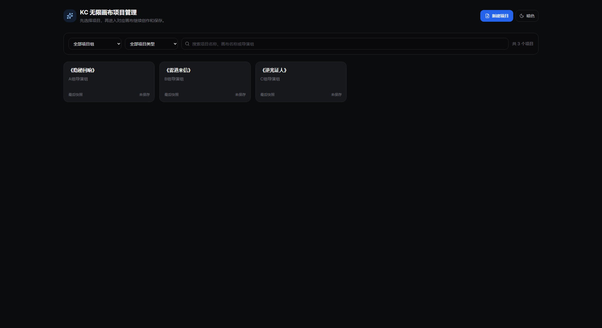

#### 画布备份弹窗

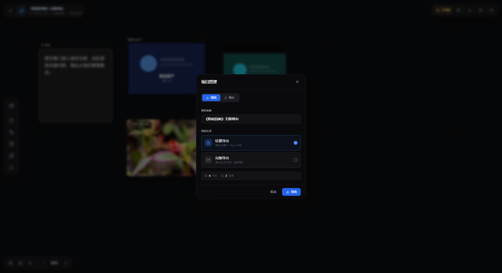

#### 画布导航与小地图

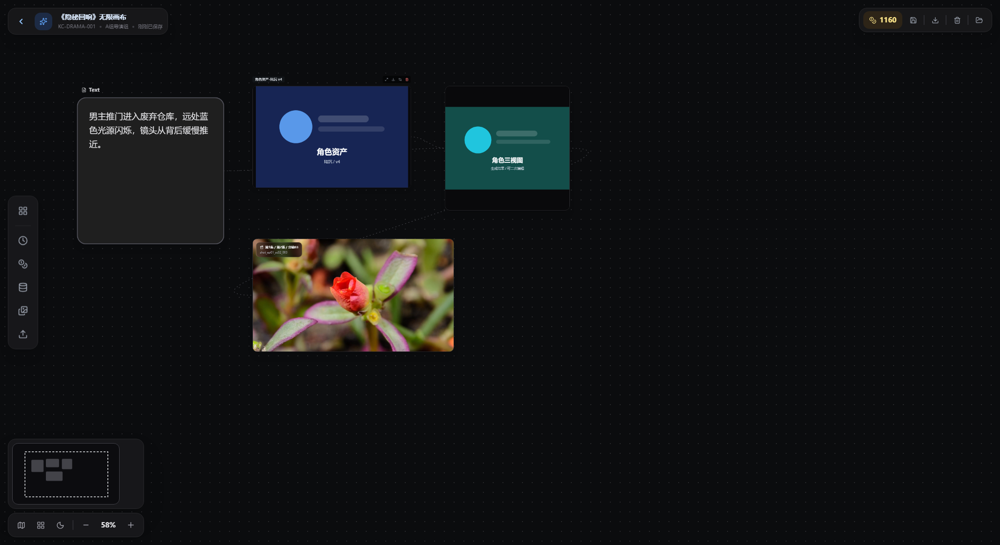

#### 当前用户积分浮层

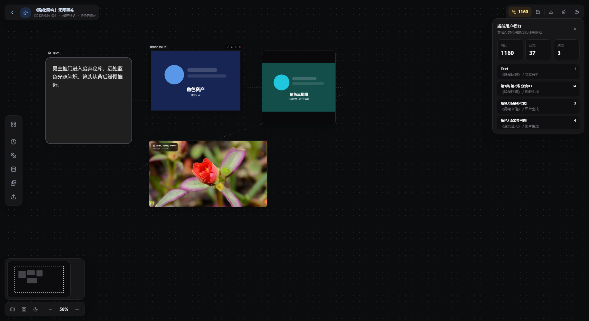

#### 资产库公共库筛选态

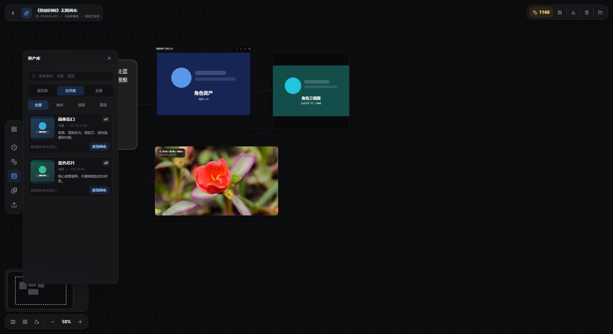

#### 统一上传菜单

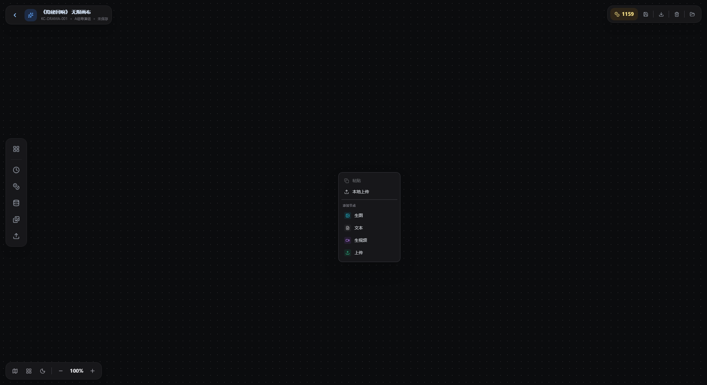

#### 资产标准图片节点

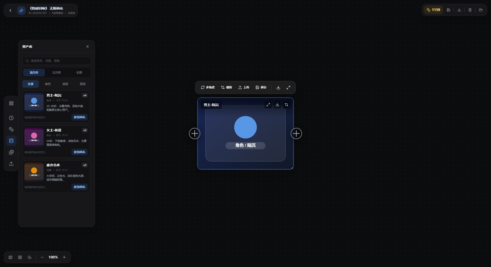

## 13. 已确认规则与待确认问题

### 13.1 已确认规则

| 编号 | 规则 | 说明 |
| --- | --- | --- |
| R1 | 一期不做自动分区机制 | 用户先自行管理画布；后续根据真实使用反馈再评估分区、分镜组、场次组 |
| R2 | 画布生成结果默认进入项目素材库 | 用户手动选择后，才保存为正式资产或更新正式资产版本 |
| R3 | 正式资产更新暂不走审核 | 有权限用户可以直接更新资产版本，但系统必须保留历史版本和来源记录 |
| R4 | Agent Skill 只预留扩展接口 | 当前阶段不实现具体 Agent Skill 能力包，只在任务、节点、项目接口上保留后续扩展空间 |
| R5 | 一期不新增独立分镜节点 | 分镜从线性系统进入画布后，由视频节点携带 `shot_id` 和分镜名称；回传线性系统放到二期 |
| R6 | PRD 截图必须保留原比例 | 原型截图独立成块展示，不放入窄表格列，不使用压缩 sheet，不强制写小宽度 |
| R7 | 产品流程图和用户 Roadmap 使用 drawio MCP 源文件维护 | 源文件保存在 `drawio/mcp-product-flow.drawio` 和 `drawio/mcp-user-roadmap.drawio`，PNG 由 drawio MCP 导出 |
| R8 | 资产入画布后按标准节点处理 | 资产库图片进入画布后不再使用特殊资产节点样式，而是标准图片结果态节点，保持裁剪、多角度、上传、保存等能力一致 |
| R9 | 上传入口按文件类型自动建节点 | 右键菜单、本地上传和连线快速菜单的上传入口都按图片/视频/文本自动生成对应节点 |

### 13.2 待确认问题

| 编号 | 问题 | 当前建议 |
| --- | --- | --- |
| Q1 | 线性系统和画布的结果回传接口字段何时定稿 | 一期先保证分镜视频能带着 `shot_id` 进入画布；二期再按接口字段做回传 |
| Q2 | 积分预扣失败时节点如何展示 | 建议生成按钮置灰，并提示余额/额度不足 |
| Q3 | 画布原型截图是否使用线上 Cloudflare 地址 | 正式评审建议使用线上地址；本次 v0.4 为了修复 PRD 和确保与当前代码一致，补充截图来自本地最新构建 |

### 13.3 一期验收清单

| 验收项 | 通过标准 |
| --- | --- |
| 项目制入口 | 用户进入工作台后先看到项目管理页，可按项目打开同一份画布 |
| 线性分镜承接 | 从线性分镜进入画布时，视频节点必须展示 `shot_id`、分镜名称、描述、历史结果和来源 |
| 上传自动建节点 | 上传图片、视频、文本后，系统自动创建对应节点，并记录来源为 `local_upload` |
| 节点迭代 | 图片/视频节点可基于上游引用、提示词和参数继续生成，并能展示任务状态 |
| 资产复用 | 用户可在项目库/公共库间切换，放入角色、场景、道具；进入画布后节点样式和普通图片结果节点一致 |
| 结果沉淀 | 用户可把结果保存到项目素材、保存为新资产或更新已有资产版本 |
| 积分管控 | 任一模型任务都有预估积分、任务状态和流水记录，不允许绕过积分服务 |
| 画布导航 | 小地图、整理画布、缩放按钮、触控板平移/缩放均可用 |
| 备份导出 | 用户可导出当前画布数据，并在导入后恢复节点、连线、项目名和视口 |
| 统一上传 | 右键菜单和连线快速菜单可通过“上传”创建图片、视频或文本节点，不再出现显式“首尾帧视频”新建入口 |
| 截图交付 | PRD 中截图独立成块，原文件为完整视口比例，不再使用压缩 sheet |

### 13.4 风险与依赖

| 风险/依赖 | 影响 | 当前处理 |
| --- | --- | --- |
| 线性系统接口未定稿 | 影响 `shot_id` 进入画布和二期回传 | PRD 先定义字段草案，研发接入前需与线性系统对齐 |
| 资产库权限边界不清 | 影响“更新正式资产”的可用范围 | 一期默认只有资产管理员或授权项目负责人可更新正式资产 |
| 积分服务接入时序 | 影响真实生成任务是否可上线 | 原型只做模拟；正式系统必须先接预估/预扣/确认扣减 |
| 触控板 wheel 监听误伤 | 可能导致输入框或滚动面板无法正常滚动 | 当前已列为实现差异，正式开发需增加事件放行规则 |
| 截图写入方式错误 | PRD 里图片被压缩成非原比例 | 后续只使用独立图片块，不写固定窄宽度 |

## 14. 下一步执行清单

### Step 1：确认 PRD 方向

- 确认产品定位。
- 确认 MVP 一期范围。
- 确认视频节点承接分镜信息、共享资产库、统一积分管控的设计原则。

### Step 2：补全详细功能需求

- 按模块补完整详细需求清单。
- 每个需求补：入口、操作流程、系统规则、字段、异常、验收标准。

### Step 3：设计原型适配任务

- 把当前线上原型需要新增/调整的界面列成开发任务。
- 区分“真实能力”和“展示型模拟能力”。

### Step 4：改造线上原型

- 在当前 `tapnow-base` 中补充带分镜信息的视频节点样式、资产库面板、积分展示等界面。
- 保留已有图片、视频、文本、裁剪、多角度功能。
- 验证 build 并推送线上。

### Step 5：自动截图并写入 PRD

- 使用浏览器自动化采集截图。
- 将截图按功能章节独立插入 PRD，不再放入窄表格单元格。
- 保留原始 PNG 文件和原始尺寸说明，避免文档内显示被压缩成错误比例。
- 输出评审版 PRD。
