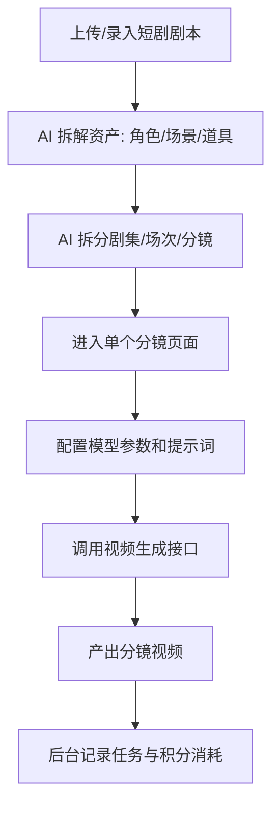
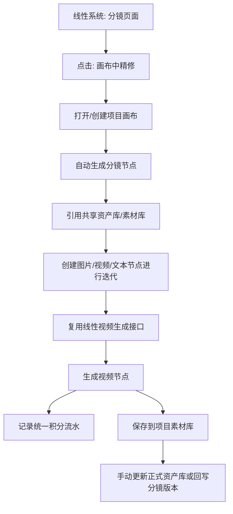
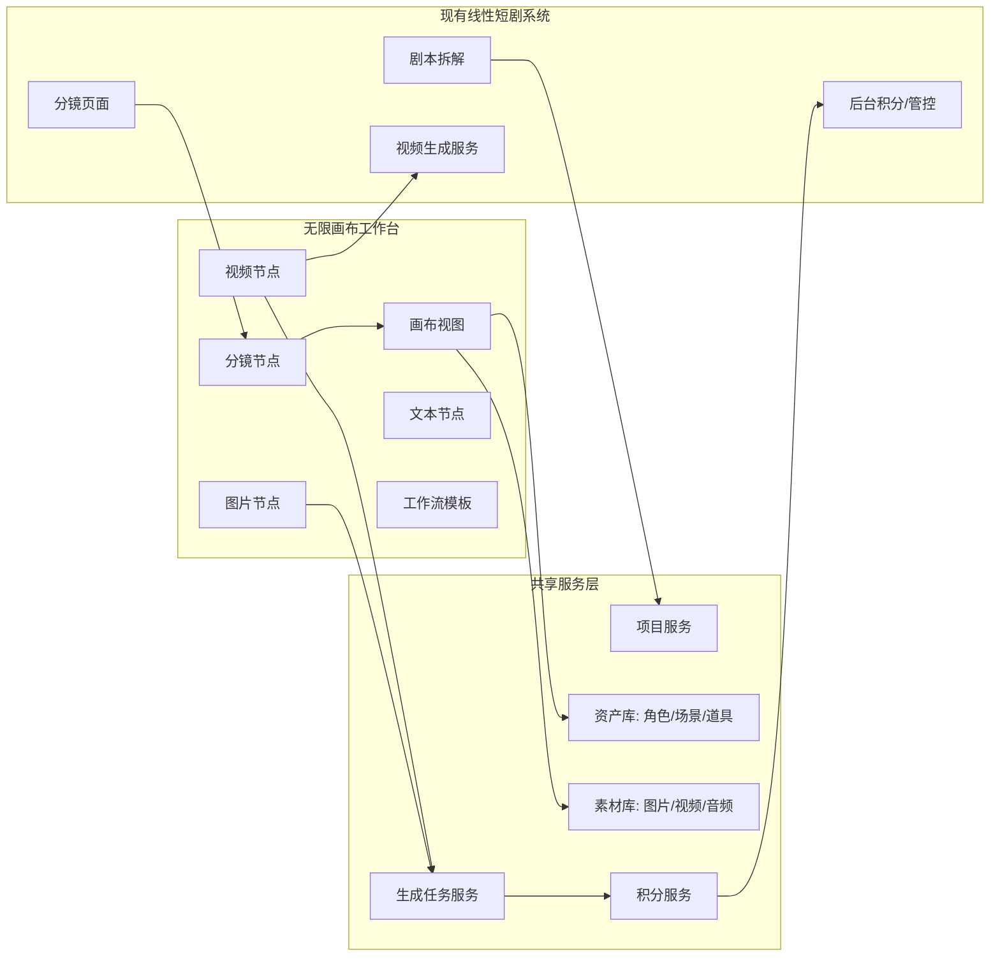

# KC 无限画布创作工作台 PRD v0.1

| 字段 | 内容 |
| --- | --- |
| 文档状态 | 草稿，待讨论 |
| 创建日期 | 2026-06-01 |
| 面向对象 | 业务方、技术负责人、前端开发、后端开发 |
| 产品定位 | 面向公司内部短剧生产的 LibTV 式无限画布创作工作台 |
| 当前阶段 | MVP 方案定义与交互原型适配 |

---

## 1. 背景与问题

公司现有短剧 AI 创作系统采用线性流水线模式，业务从一部短剧剧本开始，依次完成剧本拆解、资产拆解、分集分场分镜拆解、单分镜页面生成、模型参数配置、提示词输入和视频结果产出。

现有线性系统的优势是流程清晰、任务结构稳定、后台管控明确，适合按项目、导演组、人员和模型任务进行成本统计和业务追踪。但在创意迭代阶段，线性页面存在明显限制：

- 分镜、角色图、场景图、道具图、参考素材分散在不同页面，查看和对比效率低。
- 多轮生成结果只能在单个页面内上下翻找，不利于观察版本变化。
- 用户无法自由拖拽、连线、组合节点和自行整理创作空间，难以形成清晰的创作脉络。
- 已沉淀的工作流无法像模板一样跨项目复用。
- 业务方希望拥有类似 LibTV 的无限画布体验，在同一项目空间里完成素材管理、分镜迭代、图片/视频生成和结果复用。

因此，本项目不是替换现有线性系统，而是在现有系统基础上新增一个“无限画布创作视图”，用于承接创意发散、分镜精修、资产复用和工作流沉淀。

## 2. 产品定位

KC 无限画布创作工作台是一款面向公司内部短剧生产团队的 AI 创作画布。它与现有线性系统共享项目、分镜、资产、素材和积分数据，在画布中提供更自由的节点式创作体验。

产品定位可以概括为：

```text
线性系统负责标准生产流程、任务状态和后台管控。
无限画布负责创意发散、节点编排、版本对比和工作流复用。
两者共用资产库、素材库、视频生成服务和积分管控服务。
```

## 3. 产品目标

### 3.1 MVP 阶段目标

MVP 阶段的目标不是完整复刻 LibTV 的所有能力，而是跑通内部短剧项目的无限画布创作闭环：

- 用户可以从线性分镜页一键进入画布，对某一分镜进行自由精修。
- 用户可以按项目创建、打开和保存画布，保证画布与现有项目体系绑定。
- 用户可以在画布中拖入角色、场景、道具和素材，作为生成参考。
- 用户可以在画布中创建文本、图片、视频、分镜等节点，并进行拖拽、连线和多轮迭代。
- 用户可以复用现有线性系统的视频生成接口，生成结果以视频节点形式沉淀。
- 用户在画布中的模型消耗统一进入现有积分管控系统。
- 用户可以把画布中优化后的图片、视频保存为项目素材，或手动更新到正式资产库。
- 产品经理和前端工程师可以基于现有原型仓库继续适配演示，而不是从零搭建交互样板。

### 3.2 非目标

MVP 阶段暂不追求：

- 完整替换现有线性生产系统。
- 资产库、素材库和线性系统所有字段的完全双向同步。
- 多人实时协作。
- 完整时间线剪辑器。
- 自动分区、分镜组、场次组等强结构化画布管理能力。
- 面向外部用户的社区、会员、公开模板市场。
- Agent Skill 具体能力包和 Agent 全自动成片。

## 4. 目标用户与场景

| 用户角色 | 主要诉求 | 典型行为 |
| --- | --- | --- |
| 导演组业务人员 | 快速查看并调整分镜生成结果 | 从线性分镜页进入画布，围绕单个分镜做多轮图片/视频迭代 |
| 分镜/视频生成专员 | 批量管理参考素材和生成结果 | 在画布中拖入角色、场景、道具，连接到分镜或视频节点 |
| 资产管理员 | 维护角色、场景、道具的正式资产 | 选择保存为新资产或更新资产版本，并查看历史记录 |
| 项目负责人 | 控制项目成本和结果质量 | 查看项目画布、用量统计、重要分镜生成过程 |
| 后台管理员 | 管理积分、模型和权限 | 按项目、导演组、人员、模型维度查看消耗 |

## 5. 当前线性系统流程



## 6. 目标协同流程



## 7. 产品架构



## 8. MVP 分期策略

### 8.1 一期 MVP：画布可用 + 分镜可跳转 + 积分可管控

一期目标是让业务人员真实使用画布完成分镜微调和素材迭代，同时保证成本可控。

| 优先级 | 模块 | 功能 | 简述 |
| --- | --- | --- | --- |
| P0 | 画布基础 | 无限画布操作 | 缩放、平移、拖拽、框选、复制、删除、连线 |
| P0 | 项目管理 | 项目画布管理 | 画布与现有项目绑定，支持创建、打开、保存和最近项目 |
| P0 | 分镜互通 | 分镜页跳转画布 | 线性分镜视频可一键导入画布，生成分镜节点 |
| P0 | 分镜节点 | 分镜上下文承载 | 展示集、场、分镜描述、提示词、模型参数、结果视频 |
| P0 | 共享资产库 | 资产读取与引用 | 画布可搜索/拖入角色、场景、道具资产 |
| P0 | 共享素材库 | 素材读取与保存 | 画布可读取素材，也可保存结果到项目素材库 |
| P0 | 视频生成 | 复用线性视频接口 | 视频节点调用现有视频生成服务 |
| P0 | 积分管控 | 统一预扣与流水 | 所有模型调用必须进入现有积分系统 |
| P0 | 生成任务 | 任务状态管理 | 生成中、成功、失败、失败原因、结果地址 |
| P0 | 图片工具 | 裁剪、多角度、上传 | 支持当前原型已有核心图片编辑能力 |
| P0 | 下载导出 | 结果下载/画布导出 | 图片、视频可下载，项目画布可导出 |

### 8.2 二期：数据回写 + 批量生成 + 工作流复用

| 优先级 | 模块 | 功能 | 简述 |
| --- | --- | --- | --- |
| P1 | 分镜回写 | 画布结果回写线性分镜 | 将画布中选中的视频结果追加为分镜新版本 |
| P1 | 资产版本 | 更新正式资产版本 | 有权限用户确认后写入正式资产库，并保留历史版本 |
| P1 | 批量能力 | 批量生图/生视频 | 基于多个分镜节点批量执行生成 |
| P1 | 专业工具 | 角色三视图/九宫格/25宫格 | 复刻 LibTV 高频视觉能力 |
| P1 | 工作流模板 | 保存与复用 | 将节点组合保存为项目或团队模板 |

### 8.3 三期：深度协同 + 生产增强

| 优先级 | 模块 | 功能 | 简述 |
| --- | --- | --- | --- |
| P2 | 双向同步 | 分镜/素材/资产深度互通 | 支持更完整的数据同步和冲突处理 |
| P2 | 时间线 | 粗剪与合成 | 多视频节点拼接、音频叠加、导出 |
| P2 | 协作 | 多人协同 | 评论、任务分配、权限、协同查看 |
| P2 | 高级成本 | 预算预警与审批 | 超预算提醒、模型限额、审批流 |
| 预留 | Agent Skill | 内部自动化扩展接口 | 先预留任务、节点、项目接口，不在当前阶段实现具体 Agent 能力包 |
| 观察 | 画布分区 | 自动分区/分镜组/场次组 | 暂不做，先让用户自行管理画布；后续根据真实使用需求再设计 |

## 9. 一期 P0 详细功能需求

### 9.1 P0 范围总表

| 需求 ID | 模块 | 功能 | 优先级 | MVP 验收目标 |
| --- | --- | --- | --- | --- |
| P0-01 | 项目画布 | 项目画布管理 | P0 | 用户能以项目为单位打开、保存和继续编辑画布 |
| P0-02 | 画布基础 | 无限画布基础操作 | P0 | 用户能完成缩放、平移、拖拽、连线、复制、删除等基础操作 |
| P0-03 | 分镜互通 | 分镜页进入画布 | P0 | 用户能从线性分镜页一键进入项目画布并看到对应分镜节点 |
| P0-04 | 分镜节点 | 分镜上下文节点 | P0 | 分镜节点能承载线性系统分镜数据、历史结果和后续迭代 |
| P0-05 | 共享资产库 | 角色/场景/道具资产调用 | P0 | 线性系统资产可在画布中搜索、拖入、引用和更新版本 |
| P0-06 | 共享素材库 | 项目素材管理 | P0 | 图片/视频素材可在画布和线性系统间共用 |
| P0-07 | 图片节点 | 图片生成与二次编辑 | P0 | 图片节点支持上传、引用、生成、裁剪、多角度、保存素材 |
| P0-08 | 视频节点 | 视频生成与结果沉淀 | P0 | 视频节点复用线性视频生成接口，并在画布中展示结果 |
| P0-09 | 积分管控 | 统一积分预扣与流水 | P0 | 所有模型任务都进入现有积分服务，不允许绕过 |
| P0-10 | 生成任务 | 任务状态与失败处理 | P0 | 用户能看到生成中、成功、失败和失败原因 |
| P0-11 | 下载导出 | 结果下载与画布导出 | P0 | 用户能下载图片/视频结果，并导出当前画布数据 |

### 9.2 P0-01 项目画布管理

| 字段 | 内容 |
| --- | --- |
| 功能说明 | 无限画布必须绑定现有项目体系，用户以项目为单位创建、打开、保存和管理画布 |
| 用户入口 | 线性系统项目详情页、分镜页面“画布中精修”按钮、画布工作台项目列表 |
| 核心操作 | 打开项目画布、自动创建默认画布、手动保存、自动保存、查看最近编辑时间 |
| 系统规则 | 一期默认一个项目对应一个主画布；暂不做自动分区、分镜组、场次组 |
| 数据范围 | 画布内节点、连线、节点位置、节点参数、引用资产、引用素材、生成结果和任务记录均归属于当前项目 |
| 权限规则 | 沿用现有项目权限；用户只能打开自己有权限访问的项目画布 |
| 保存规则 | 画布状态自动保存，用户也可以手动触发保存；保存失败时需要提示并允许重试 |
| 异常处理 | 无项目权限时禁止进入；画布加载失败时展示重试入口；自动保存失败时保留本地临时状态 |
| 原型截图 | S01 画布总览，S02 分镜节点详情 |
| 验收标准 | 用户从项目或分镜进入画布后，能看到与该项目绑定的同一份画布数据；刷新页面后节点位置和连线不丢失 |

### 9.3 P0-02 无限画布基础操作

| 字段 | 内容 |
| --- | --- |
| 功能说明 | 提供类似 LibTV 的自由画布基础体验，让用户可以像整理白板一样摆放、连接和管理创作内容 |
| 支持节点 | 分镜节点、文本节点、图片节点、视频节点、资产节点、素材节点 |
| 基础操作 | 缩放、平移、拖拽节点、框选、多选、复制、粘贴、删除、撤销预留、右键菜单 |
| 连线规则 | 节点之间可通过连接端口建立引用关系；连线表示“上游节点作为下游节点的输入或参考” |
| 输入规则 | 图片、视频、文本、资产均可作为其他生成节点的入参；不同节点根据能力限制接受的输入类型 |
| 视觉规则 | 节点主体内容可随画布缩放；节点参数面板应尽量保持可编辑性，避免缩小时无法操作 |
| 右键菜单 | 画布右键支持新建节点、本地上传、粘贴；节点右键支持复制、删除、保存素材等 |
| 异常处理 | 连线不合法时不建立关系，并给出轻提示；删除节点时同步删除相关连线 |
| 原型截图 | S01 画布总览 |
| 验收标准 | 用户能在一个项目画布中完成至少 20 个节点的创建、移动、连线和删除，基础操作无明显卡顿 |

### 9.4 P0-03 分镜页进入画布

| 字段 | 内容 |
| --- | --- |
| 功能说明 | 在线性系统的分镜页面提供“画布中精修”入口，把已有分镜视频导入画布继续微调 |
| 用户入口 | 分镜页面右上角、生成结果区域、历史版本区域 |
| 用户操作 | 点击“画布中精修”后进入该项目主画布，并定位到对应分镜节点 |
| 系统规则 | 如果该分镜已有画布节点，则打开并定位；如果没有，则在项目主画布中自动创建 |
| 导入内容 | 分镜描述、提示词、模型参数、参考资产、参考素材、历史图片、历史视频、当前选中视频结果 |
| 定位规则 | 一期不做自动分区，但需要把新建分镜节点放在可见区域，避免用户进入画布后找不到 |
| 异常处理 | 分镜数据缺失时仍创建节点，但标记“数据不完整”；视频结果缺失时显示空结果状态 |
| 原型截图 | S02 分镜节点详情 |
| 验收标准 | 用户从分镜页进入画布后，能在 3 秒内看到对应分镜节点和现有视频结果 |

### 9.5 P0-04 分镜节点

| 字段 | 内容 |
| --- | --- |
| 功能说明 | 分镜节点是线性系统和画布的核心桥接节点，用于承载一个具体分镜的上下文和生成结果 |
| 节点内容 | 项目名、集数、场次、分镜编号、分镜描述、提示词、模型参数、参考资产、参考素材、当前视频结果 |
| 支持操作 | 拖拽、连线、复制、查看大图/视频、发起视频生成、保存新版本、打开线性分镜页 |
| 输入来源 | 线性分镜数据、上游图片节点、上游视频节点、角色/场景/道具资产、项目素材 |
| 输出结果 | 新图片节点、新视频节点、项目素材、分镜新版本 |
| 版本规则 | 画布生成结果默认不覆盖线性分镜原结果，只追加版本；是否设为当前版本由用户手动确认 |
| 展示规则 | 分镜节点应突出“这是哪个项目/哪一集/哪一场/哪一个分镜”，避免和普通视频节点混淆 |
| 异常处理 | 如果分镜已被线性系统删除或无权限访问，节点保留但标记为“来源不可用” |
| 原型截图 | S02 分镜节点详情，S04 视频节点生成 |
| 验收标准 | 用户可以从分镜节点继续生成视频，并把结果追加为该分镜的新版本 |

### 9.6 P0-05 共享资产库

| 字段 | 内容 |
| --- | --- |
| 功能说明 | 画布与线性系统共用角色、场景、道具资产库，避免两套资产割裂 |
| 用户入口 | 画布左侧资产面板、节点参考素材选择器、节点工具条“保存到资产库” |
| 资产类型 | 角色、场景、道具，后续可扩展风格、镜头、音色等资产类型 |
| 支持操作 | 搜索、筛选、预览、拖入画布、引用到节点、保存为新资产、更新资产版本 |
| 引用规则 | 拖入画布后生成资产节点或素材缩略卡；作为其他节点输入时使用 `asset_id` 引用 |
| 写入规则 | 画布生成结果默认保存到项目素材库；有权限用户手动选择后才写入正式资产库 |
| 版本规则 | 暂不设置审核流程；资产更新必须生成历史版本记录，支持查看来源画布、来源节点、更新人和更新时间 |
| 权限规则 | 沿用现有资产库权限；无写入权限的用户只能引用和保存到项目素材 |
| 异常处理 | 资产加载失败时展示空态和重试；资产已删除时保留节点但标记来源失效 |
| 原型截图 | S03 资产库拖入画布，S06 保存到素材/资产库 |
| 验收标准 | 线性系统已有资产可在画布中被搜索、拖入和引用；有权限用户可把画布结果更新为资产新版本 |

### 9.7 P0-06 共享素材库

| 字段 | 内容 |
| --- | --- |
| 功能说明 | 图片、视频、音频素材在画布和线性系统中共用，重点支持项目素材沉淀 |
| 用户入口 | 左侧素材库、画布右键菜单、节点本地上传按钮、结果节点工具条 |
| 素材范围 | 项目素材、个人素材、团队素材；一期优先项目素材和本地上传 |
| 支持操作 | 上传、搜索、预览、拖入、复制、删除、下载、保存生成结果 |
| 保存规则 | 画布生成结果默认可保存到项目素材库；保存后线性系统的视频节点可调用 |
| 引用规则 | 素材进入画布后应成为标准节点或节点入参，支持二次编辑和继续连线 |
| 删除规则 | 删除画布节点不等于删除素材库源文件；从素材库删除需二次确认并受权限限制 |
| 异常处理 | 上传格式不支持时提示；大文件上传失败时允许重试；素材不存在时展示失效状态 |
| 原型截图 | S03 资产库拖入画布，S06 保存到素材/资产库 |
| 验收标准 | 画布生成的视频结果可保存到项目素材，并能被线性视频节点调用 |

### 9.8 P0-07 图片节点

| 字段 | 内容 |
| --- | --- |
| 功能说明 | 图片节点用于承载本地上传、素材库引用、模型生成、裁剪结果和多角度结果 |
| 用户入口 | 画布右键新建、左侧添加节点、本地上传、资产/素材拖入、分镜节点生成结果 |
| 输入 | 提示词、参考图片、角色/场景/道具资产、上游图片/视频截图、画幅、模型参数 |
| 输出 | 图片结果、图片版本、项目素材、正式资产版本 |
| 支持工具 | 本地上传、图片生成、裁剪、多角度控制、下载、放大查看、保存到素材库、更新资产版本 |
| 裁剪规则 | 裁剪画幅只能使用节点支持的画幅比例；裁剪后生成新的标准图片节点 |
| 多角度规则 | 多角度结果默认以完整场景为目标，不只处理人物或局部主体 |
| 结果规则 | 任意来源进入画布的图片都应等同于新建图片节点后上传图片，可继续编辑 |
| 异常处理 | 图片读取失败时显示占位；跨域图片无法裁剪时提示用户先保存为本地素材 |
| 原型截图 | S01 画布总览，S06 保存到素材/资产库 |
| 验收标准 | 用户可以围绕一张图片完成上传、裁剪、多角度、保存素材的完整闭环 |

### 9.9 P0-08 视频节点

| 字段 | 内容 |
| --- | --- |
| 功能说明 | 视频节点复用现有线性系统视频生成能力，并在画布中沉淀视频结果和每次修改记录 |
| 用户入口 | 画布右键新建、分镜节点发起生成、图片节点转视频、素材库视频拖入 |
| 输入 | 提示词、参考图片、参考视频、资产 ID、素材 ID、分镜上下文、模型参数 |
| 输出 | 视频 URL、封面图、任务状态、积分消耗、项目素材、分镜新版本 |
| 接口策略 | 一期不新建一套视频生成服务，复用线性系统已有视频生成接口 |
| 生成流程 | 预估积分 -> 预扣积分 -> 创建生成任务 -> 调用线性视频接口 -> 轮询/接收结果 -> 确认扣减 -> 写入节点 |
| 结果操作 | 播放、暂停、放大查看、下载、保存到项目素材、追加为分镜新版本 |
| 异常处理 | 生成失败时展示失败原因；积分返还或解冻；允许用户复制参数后重试 |
| 原型截图 | S04 视频节点生成，S05 积分预估与扣减 |
| 验收标准 | 用户在画布中点击生成后，可看到任务状态和最终视频节点，后台能看到对应积分流水 |

### 9.10 P0-09 积分管控

| 字段 | 内容 |
| --- | --- |
| 功能说明 | 画布所有模型调用统一接入现有积分服务，保证项目成本可控 |
| 核心规则 | 预估消耗、预扣积分、任务执行、确认扣减、失败返还或解冻 |
| 统计维度 | 项目、导演组、用户、模型、任务类型、节点、分镜、资产、素材 |
| 前台展示 | 生成按钮附近展示预估积分；余额或额度不足时禁止发起任务 |
| 后台展示 | 复用现有后台，按项目、导演组、业务人员、模型、任务类型查看消耗 |
| 最低要求 | 不允许绕过积分服务直接调用模型；无积分流水的任务视为异常任务 |
| 异常处理 | 预扣失败禁止生成；任务超时按失败处理；结果生成但扣减失败时进入异常待处理状态 |
| 原型截图 | S05 积分预估与扣减，S08 后台积分看板 |
| 验收标准 | 后台可查看画布产生的每一笔模型消耗流水，并能追溯到项目、用户、节点和分镜 |

### 9.11 P0-10 生成任务状态

| 字段 | 内容 |
| --- | --- |
| 功能说明 | 画布需要统一展示图片、视频、文本分析等生成任务状态 |
| 任务状态 | 待预扣、排队中、生成中、成功、失败、已取消、异常待处理 |
| 前台展示 | 节点内显示加载态、进度或状态文案；失败时显示失败原因和重试入口 |
| 数据记录 | 任务 ID、发起人、节点 ID、分镜 ID、模型、参数、积分记录、结果地址、错误信息 |
| 操作支持 | 取消任务预留、失败重试、复制参数、查看任务详情 |
| 异常处理 | 接口超时、模型失败、积分失败、结果地址失效都需要可被记录和展示 |
| 原型截图 | S04 视频节点生成，S05 积分预估与扣减 |
| 验收标准 | 用户不需要打开开发者工具，也能知道任务是否成功、为什么失败、是否扣费 |

### 9.12 P0-11 下载导出

| 字段 | 内容 |
| --- | --- |
| 功能说明 | 在一期未完全打通所有线性系统数据前，保证业务结果可以被下载、迁移和复盘 |
| 下载范围 | 图片结果、视频结果、节点内参考素材 |
| 导出范围 | 当前项目画布数据，包括节点、连线、位置、参数、引用关系和必要的结果地址 |
| 用户入口 | 节点工具条、素材库右键菜单、顶部工具栏“导出” |
| 系统规则 | 下载素材不改变资产库和素材库状态；导出文件用于备份或交付给研发排查 |
| 异常处理 | 下载失败时打开原始地址；导出失败时提示重试；缺失资源在导出文件中标记失效 |
| 原型截图 | S01 画布总览，S06 保存到素材/资产库 |
| 验收标准 | 用户可以把核心图片/视频结果下载到本地，并能导出当前画布项目文件 |

## 10. 数据字段定义草案

本章节用于技术对齐，不要求一期完全按该结构新建表，但前后端接口返回字段应尽量向该结构靠齐，避免后续重构时再次转换。

### 10.1 项目画布字段

```json
{
  "canvas_id": "canvas_001",
  "project_id": "project_001",
  "canvas_name": "《短剧项目A》主画布",
  "status": "active",
  "viewport": {
    "x": 0,
    "y": 0,
    "zoom": 1
  },
  "node_count": 18,
  "edge_count": 24,
  "created_by": "user_001",
  "updated_by": "user_002",
  "created_at": "2026-06-01T00:00:00+08:00",
  "updated_at": "2026-06-01T00:10:00+08:00"
}
```

| 字段 | 必填 | 说明 |
| --- | --- | --- |
| `canvas_id` | 是 | 画布唯一 ID |
| `project_id` | 是 | 绑定现有项目 ID |
| `viewport` | 否 | 用户最后查看画布的位置和缩放 |
| `status` | 是 | `active` / `archived` |

### 10.2 画布节点通用字段

```json
{
  "node_id": "node_001",
  "canvas_id": "canvas_001",
  "project_id": "project_001",
  "node_type": "shot",
  "title": "第1集-第2场-分镜3",
  "position": { "x": 120, "y": 80 },
  "size": { "width": 560, "height": 360 },
  "source": "linear_pipeline",
  "source_ref_id": "shot_001",
  "data": {},
  "created_by": "user_001",
  "updated_by": "user_001",
  "created_at": "2026-06-01T00:00:00+08:00",
  "updated_at": "2026-06-01T00:00:00+08:00"
}
```

| `node_type` 枚举 | 说明 |
| --- | --- |
| `shot` | 分镜节点 |
| `text` | 文本节点 |
| `image` | 图片节点 |
| `video` | 视频节点 |
| `asset` | 角色/场景/道具资产节点 |
| `material` | 素材节点 |

### 10.3 分镜节点 data 字段

```json
{
  "episode_id": "ep_001",
  "episode_no": 1,
  "scene_id": "scene_001",
  "scene_no": 2,
  "shot_id": "shot_001",
  "shot_no": 3,
  "shot_description": "男主推门进入废弃仓库，看到远处闪烁的蓝色光源。",
  "prompt": "当前视频生成提示词",
  "negative_prompt": "负面提示词",
  "model_config": {
    "model_id": "linear_video_model",
    "duration": "5s",
    "ratio": "16:9",
    "resolution": "1080p"
  },
  "reference_asset_ids": ["asset_role_001", "asset_scene_001"],
  "reference_material_ids": ["mat_img_001"],
  "current_version_id": "shot_version_003",
  "versions": [
    {
      "version_id": "shot_version_003",
      "type": "video",
      "url": "https://example.com/video.mp4",
      "cover_url": "https://example.com/cover.png",
      "task_id": "task_001",
      "created_at": "2026-06-01T00:00:00+08:00"
    }
  ]
}
```

### 10.4 资产引用字段

```json
{
  "asset_id": "asset_role_001",
  "asset_type": "role",
  "asset_name": "男主-陆沉",
  "current_version_id": "asset_version_004",
  "preview_url": "https://example.com/role.png",
  "source": "asset_library",
  "can_update": true,
  "metadata": {
    "gender": "male",
    "age_range": "25-30",
    "description": "角色资产描述"
  }
}
```

| `asset_type` 枚举 | 说明 |
| --- | --- |
| `role` | 角色资产 |
| `scene` | 场景资产 |
| `prop` | 道具资产 |

### 10.5 素材字段

```json
{
  "material_id": "mat_001",
  "project_id": "project_001",
  "material_type": "video",
  "name": "分镜3-优化版视频",
  "url": "https://example.com/result.mp4",
  "cover_url": "https://example.com/result-cover.png",
  "source": "canvas_generation",
  "source_canvas_id": "canvas_001",
  "source_node_id": "node_001",
  "source_task_id": "task_001",
  "created_by": "user_001",
  "created_at": "2026-06-01T00:00:00+08:00"
}
```

| `material_type` 枚举 | 说明 |
| --- | --- |
| `image` | 图片素材 |
| `video` | 视频素材 |
| `audio` | 音频素材 |
| `text` | 文本素材或提示词素材 |

### 10.6 生成任务字段

```json
{
  "task_id": "task_001",
  "project_id": "project_001",
  "canvas_id": "canvas_001",
  "node_id": "node_001",
  "shot_id": "shot_001",
  "task_type": "video_generation",
  "status": "running",
  "model_vendor": "internal_video_service",
  "model_id": "linear_video_model",
  "input": {
    "prompt": "视频提示词",
    "asset_ids": ["asset_role_001"],
    "material_ids": ["mat_img_001"],
    "params": {}
  },
  "output": {
    "urls": [],
    "cover_url": ""
  },
  "credit_record_id": "credit_001",
  "error_code": "",
  "error_message": "",
  "created_by": "user_001",
  "created_at": "2026-06-01T00:00:00+08:00",
  "completed_at": ""
}
```

| `status` 枚举 | 说明 |
| --- | --- |
| `pending_credit` | 待积分预扣 |
| `queued` | 排队中 |
| `running` | 生成中 |
| `succeeded` | 成功 |
| `failed` | 失败 |
| `cancelled` | 已取消 |
| `credit_exception` | 积分异常待处理 |

### 10.7 积分流水字段

```json
{
  "credit_record_id": "credit_001",
  "project_id": "project_001",
  "director_group_id": "group_001",
  "user_id": "user_001",
  "canvas_id": "canvas_001",
  "node_id": "node_001",
  "shot_id": "shot_001",
  "task_id": "task_001",
  "task_type": "video_generation",
  "model_vendor": "internal_video_service",
  "model_id": "linear_video_model",
  "estimated_credit": 10,
  "reserved_credit": 10,
  "actual_credit": 9,
  "status": "confirmed",
  "created_at": "2026-06-01T00:00:00+08:00",
  "completed_at": "2026-06-01T00:01:00+08:00"
}
```

| `status` 枚举 | 说明 |
| --- | --- |
| `reserved` | 已预扣 |
| `confirmed` | 已确认扣减 |
| `released` | 已返还或解冻 |
| `failed` | 扣费失败 |
| `exception` | 异常待人工处理 |

### 10.8 画布连线字段

```json
{
  "edge_id": "edge_001",
  "canvas_id": "canvas_001",
  "project_id": "project_001",
  "source_node_id": "node_asset_001",
  "target_node_id": "node_video_001",
  "edge_type": "reference",
  "created_by": "user_001",
  "created_at": "2026-06-01T00:00:00+08:00"
}
```

| `edge_type` 枚举 | 说明 |
| --- | --- |
| `reference` | 上游作为参考输入 |
| `derive` | 下游由上游生成或编辑得到 |
| `version` | 同一对象的版本关系 |

## 11. 正式前端选型建议

### 11.1 当前原型的定位

当前 `tapnow-base` 原型适合继续用于：

- 验证无限画布的核心交互。
- 验证节点参数面板和工具菜单。
- 验证本地上传、裁剪、多角度、素材库等体验。
- 生成产品方案所需的原型截图。
- 给前端工程师参考节点 UI 和业务交互。

当前原型不建议作为正式生产系统完整底座直接长期演进，因为它的画布事件系统是轻量自研，后续面对复杂多选、分组、撤销重做、大规模节点、嵌套工作流和性能优化时维护成本较高。

### 11.2 正式工程建议

正式前端建议采用：

```text
React + TypeScript + React Flow / xyflow + 现有业务组件复用
```

原因：

- React Flow 原生支持节点、连线、缩放、平移和自定义节点，可以减少基础画布交互的自研成本。
- 后续如果需要分镜组、场次组、工作流模板，React Flow 已经有较成熟的父子节点和分组能力，正式开发不需要从零实现。
- 前端工程师可把当前原型中的节点 UI、参数面板、素材库、工具栏设计迁移到 React Flow 自定义节点中。
- 可以减少正式工程在基础画布交互上的自研成本。

## 12. 原型适配与截图计划

为了支持 PRD 和评审材料，当前线上原型需要按正式方案做一次“展示型适配”。这次适配不是要把所有真实后端接口一次性接完，而是让业务方和技术同学打开原型后，能直观看到 MVP 版本要做成什么样、每个功能入口在哪里、用户点击后会发生什么。

原型改造分两类：

- **真实可操作能力**：沿用当前原型已有能力，例如画布拖拽、连线、上传、图片裁剪、多角度编辑、素材预览、下载。
- **展示型模拟能力**：先用静态演示数据模拟，例如项目列表、分镜节点数据、资产库数据、积分预估、后台积分看板。后续正式开发时替换为真实接口。

### 12.1 原型适配任务

| 任务 ID | 原型任务 | 类型 | 对应 PRD 功能 | 说明 |
| --- | --- | --- | --- | --- |
| UI-01 | 项目入口与项目状态展示 | 静态演示数据 + 真实导航 | P0-01 | 在画布顶部显示当前项目名、项目编号、最近保存时间，并提供“项目列表/返回线性系统”的入口 |
| UI-02 | 分镜节点 | 静态演示数据 + 真实节点交互 | P0-03 / P0-04 | 新增分镜节点，展示集、场、分镜编号、分镜描述、历史视频结果和“生成新版”按钮 |
| UI-03 | 线性跳转模拟页 | 静态演示数据 | P0-03 | 做一个简化的“线性分镜页”入口，用户点击“画布中精修”后进入画布并定位分镜节点 |
| UI-04 | 资产库面板 | 静态演示数据 + 真实拖入 | P0-05 | 左侧增加资产库，区分角色、场景、道具，支持搜索、预览、拖入画布 |
| UI-05 | 素材库面板升级 | 静态演示数据 + 复用已有素材库 | P0-06 | 当前素材库补充项目素材、个人素材、上传素材分类，支持右键保存、复制、删除 |
| UI-06 | 图片节点结果工具条 | 真实交互 + 模拟保存 | P0-07 | 图片有结果后，节点上方显示裁剪、多角度、下载、保存到项目素材、更新资产版本 |
| UI-07 | 视频节点生成面板 | 模拟接口 + 真实任务状态展示 | P0-08 / P0-10 | 视频节点展示提示词、参考素材、预估积分、生成按钮、生成中状态、成功视频结果、失败提示 |
| UI-08 | 积分预估与扣减提示 | 静态演示数据 | P0-09 | 在生成按钮旁展示“预计消耗 X 积分”，点击生成后展示“已预扣/已确认扣减/失败返还”状态 |
| UI-09 | 保存到项目素材/更新资产弹窗 | 静态演示数据 | P0-05 / P0-06 | 用户点击保存时弹出选择：保存到项目素材、保存为新资产、更新已有资产版本 |
| UI-10 | 后台积分看板截图页 | 静态演示数据 | P0-09 | 做一个独立演示页或弹窗，用静态表格展示项目、导演组、人员、模型消耗 |
| UI-11 | 任务失败态 | 静态演示数据 | P0-10 | 视频/图片节点支持展示失败原因、重试按钮、复制参数按钮 |
| UI-12 | 画布导出入口 | 复用已有能力 | P0-11 | 顶部工具栏保留导出项目，文案改为更贴近业务：“导出画布备份” |

### 12.2 具体原型任务说明

#### UI-01 项目入口与项目状态展示

| 项 | 说明 |
| --- | --- |
| 要做什么 | 在画布顶部左侧增加项目信息区域，让用户知道当前正在编辑哪个短剧项目 |
| 页面位置 | 当前标题区域，替换或扩展现有“KC画布 MVP 试用项目” |
| 展示内容 | 项目名、项目编号、导演组、最近保存时间、保存状态 |
| 用户操作 | 点击项目名可展开项目菜单；点击“返回线性系统”模拟回到原分镜页面 |
| 状态示例 | `已保存`、`保存中`、`保存失败，点击重试` |
| 原型数据 | 使用静态演示项目：`《隐秘回响》 / 项目ID KC-DRAMA-001 / A组导演组` |
| 截图用途 | 证明画布是项目制工作台，不是一个孤立画板 |

#### UI-02 分镜节点

| 项 | 说明 |
| --- | --- |
| 要做什么 | 新增一种分镜节点，用来表示线性系统里的某一个具体分镜 |
| 节点标题 | `第1集 第2场 分镜03` |
| 节点主体 | 上半部分展示当前视频封面或视频播放器；下半部分展示分镜描述、提示词摘要、参考资产缩略图 |
| 节点按钮 | `打开线性分镜页`、`生成新版视频`、`保存为分镜新版本`、`下载视频` |
| 用户操作 | 用户可以把角色资产、场景资产、图片节点连到分镜节点，作为生成参考 |
| 结果展示 | 点击生成后，节点显示生成中；成功后展示新视频结果；失败后显示失败原因 |
| 原型数据 | 使用静态分镜描述和静态视频封面；生成可先用模拟 loading 和固定视频/图片结果 |
| 截图用途 | 说明“线性分镜页如何进入画布精修” |

#### UI-03 线性跳转模拟页

| 项 | 说明 |
| --- | --- |
| 要做什么 | 在原型里做一个简化入口，用于模拟用户从现有线性分镜页面跳到无限画布 |
| 页面内容 | 项目名、集/场/分镜信息、当前生成视频、按钮“画布中精修” |
| 用户操作 | 点击“画布中精修”后进入画布，并自动定位到分镜节点 |
| 原型实现 | 可以是一个弹窗、侧栏入口或独立 demo 页面，不要求还原完整线性系统 |
| 截图用途 | 说明两个系统不是割裂的，分镜可以进入画布继续编辑 |

#### UI-04 资产库面板

| 项 | 说明 |
| --- | --- |
| 要做什么 | 在左侧侧栏新增“资产库”，用户可以找到已有角色、场景、道具 |
| 一级分类 | `角色`、`场景`、`道具` |
| 资产卡片 | 缩略图、资产名称、资产类型、当前版本、更新时间 |
| 用户操作 | 搜索资产、点击预览、拖入画布、右键保存/复制引用 |
| 拖入结果 | 拖入后生成资产节点或素材缩略卡，节点显示资产名和预览图 |
| 原型数据 | 使用 3 个角色、2 个场景、2 个道具静态演示数据 |
| 截图用途 | 说明画布与现有资产库共用同一批资产 |

#### UI-05 素材库面板升级

| 项 | 说明 |
| --- | --- |
| 要做什么 | 把当前素材库从“生成结果集合”升级成更接近业务的项目素材入口 |
| 分类 | `项目素材`、`本地上传`、`生成结果` |
| 素材卡片 | 图片/视频缩略图、名称、来源、创建时间 |
| 用户操作 | 预览、拖入画布、右键保存素材、复制、删除、下载 |
| 删除规则 | 原型里只删除画布展示数据；正式系统删除素材库源文件需要权限和二次确认 |
| 截图用途 | 展示画布生成结果如何沉淀为项目素材 |

#### UI-06 图片节点结果工具条

| 项 | 说明 |
| --- | --- |
| 要做什么 | 图片节点有结果后，隐藏下方生成参数面板，在节点上方展示二次处理工具条 |
| 工具按钮 | `裁剪`、`多角度`、`下载`、`保存到项目素材`、`更新资产版本`、`放大查看` |
| 用户操作 | 用户点击裁剪/多角度继续生成新图片节点；点击保存则弹出保存选择 |
| 关键规则 | 已有图片结果时，节点重点是二次优化，不再默认展示生图输入框 |
| 截图用途 | 展示图片节点如何支持多轮迭代和资产沉淀 |

#### UI-07 视频节点生成面板

| 项 | 说明 |
| --- | --- |
| 要做什么 | 视频节点展示复用线性视频生成接口的操作入口 |
| 面板内容 | 提示词输入框、参考素材缩略图、模型参数、预估积分、生成按钮 |
| 生成前 | 用户可以编辑提示词、选择参考图/视频、查看预估积分 |
| 生成中 | 节点显示 loading、任务状态文案，如“视频生成中，预计 1-3 分钟” |
| 生成后 | 节点展示视频播放器、下载、保存到项目素材、追加为分镜新版本 |
| 失败态 | 展示失败原因、重试、复制参数 |
| 原型实现 | 可以先用模拟任务状态，不要求真实调用线性视频接口 |
| 截图用途 | 展示从填写提示词到生成视频结果的完整过程 |

#### UI-08 积分预估与扣减提示

| 项 | 说明 |
| --- | --- |
| 要做什么 | 让用户在点击生成前就知道预计消耗多少积分 |
| 展示位置 | 节点生成按钮旁、生成任务状态区域、后台积分看板 |
| 展示文案 | `预计消耗 10 积分`、`已预扣 10 积分`、`生成成功，实际扣减 9 积分`、`生成失败，积分已返还` |
| 异常态 | 余额不足时生成按钮置灰，提示“项目额度不足，请联系管理员” |
| 原型实现 | 使用静态积分数据和模拟状态切换 |
| 截图用途 | 证明一期已经考虑成本管控 |

#### UI-09 保存到项目素材/更新资产弹窗

| 项 | 说明 |
| --- | --- |
| 要做什么 | 用户对满意的图片/视频结果，可以选择保存位置 |
| 触发入口 | 图片节点工具条、视频节点工具条、素材右键菜单 |
| 弹窗选项 | `保存到项目素材`、`保存为新资产`、`更新已有资产版本` |
| 表单字段 | 名称、类型、关联角色/场景/道具、备注 |
| 历史规则 | 更新已有资产版本时，文案提示“会保留历史版本，不覆盖旧结果” |
| 原型实现 | 先模拟保存成功提示，不要求真实写入资产库 |
| 截图用途 | 展示画布结果如何回到资产/素材体系 |

#### UI-10 后台积分看板截图页

| 项 | 说明 |
| --- | --- |
| 要做什么 | 为 PRD 截图准备一个简化后台看板，说明画布消耗能被后台管控 |
| 展示维度 | 项目、导演组、用户、模型、任务类型、消耗积分、任务状态 |
| 数据形式 | 表格 + 顶部统计卡片 |
| 统计卡片 | 今日消耗、项目剩余额度、失败返还、异常任务 |
| 原型实现 | 可以作为画布中的弹窗或单独静态演示页面 |
| 截图用途 | 给技术和业务方看积分管控闭环 |

#### UI-11 任务失败态

| 项 | 说明 |
| --- | --- |
| 要做什么 | 节点生成失败时，用户能看懂为什么失败，以及下一步能做什么 |
| 失败原因示例 | `积分不足`、`视频生成接口超时`、`参考素材失效`、`模型返回为空` |
| 用户操作 | 重试、复制参数、查看任务详情、关闭提示 |
| 积分提示 | 如果失败已返还积分，需要明确显示“积分已返还” |
| 截图用途 | 展示产品不是只考虑成功路径 |

#### UI-12 画布导出入口

| 项 | 说明 |
| --- | --- |
| 要做什么 | 保留当前导出能力，但文案和范围更贴近业务 |
| 入口文案 | `导出画布备份` |
| 导出内容 | 节点、连线、节点位置、参数、引用素材、结果地址 |
| 用户操作 | 点击顶部导出按钮，下载项目画布 JSON 文件 |
| 截图用途 | 说明一期即使部分接口未打通，也能保证结果迁移和备份 |

### 12.3 截图清单

| 截图编号 | 截图名称 | 用途 |
| --- | --- | --- |
| S01 | 画布总览 | 展示项目画布、分镜节点、图片节点、视频节点、素材与资产面板 |
| S02 | 分镜节点详情 | 展示线性分镜数据如何进入画布 |
| S03 | 资产库拖入画布 | 展示角色/场景/道具资产复用 |
| S04 | 视频节点生成 | 展示复用线性视频接口和任务状态 |
| S05 | 积分预估与扣减 | 展示生成前后的积分规则 |
| S06 | 保存到素材/资产库 | 展示项目素材与正式资产更新入口 |
| S07 | 工作流模板保存 | 展示工作流沉淀和复用 |
| S08 | 后台积分看板 | 展示项目、导演组、人员、模型维度消耗 |

### 12.4 截图采集方式

后续原型适配完成后，使用浏览器自动化访问线上地址，按固定视口采集截图，并将截图插入 PRD：

```text
1. 打开线上原型
2. 登录
3. 进入指定演示画布
4. 调整到固定视口和缩放比例
5. 截取功能截图
6. 写入 PRD 对应章节
```

## 13. 已确认规则与待确认问题

### 13.1 已确认规则

| 编号 | 规则 | 说明 |
| --- | --- | --- |
| R1 | 一期不做自动分区机制 | 用户先自行管理画布；后续根据真实使用反馈再评估分区、分镜组、场次组 |
| R2 | 画布生成结果默认进入项目素材库 | 用户手动选择后，才保存为正式资产或更新正式资产版本 |
| R3 | 正式资产更新暂不走审核 | 有权限用户可以直接更新资产版本，但系统必须保留历史版本和来源记录 |
| R4 | Agent Skill 只预留扩展接口 | 当前阶段不实现具体 Agent Skill 能力包，只在任务、节点、项目接口上保留后续扩展空间 |

### 13.2 待确认问题

| 编号 | 问题 | 当前建议 |
| --- | --- | --- |
| Q1 | 分镜节点是否一期就要支持结果回写线性系统 | 一期支持“保存为新版本”，是否设为当前版本由用户手动确认 |
| Q2 | 积分预扣失败时节点如何展示 | 建议生成按钮置灰，并提示余额/额度不足 |
| Q3 | 画布原型截图是否使用线上 Cloudflare 地址 | 建议使用线上地址，保证截图接近业务方实际体验 |

## 14. 下一步执行清单

### Step 1：确认 PRD 方向

- 确认产品定位。
- 确认 MVP 一期范围。
- 确认分镜节点、共享资产库、统一积分管控的设计原则。

### Step 2：补全详细功能需求

- 按模块补完整详细需求清单。
- 每个需求补：入口、操作流程、系统规则、字段、异常、验收标准。

### Step 3：设计原型适配任务

- 把当前线上原型需要新增/调整的界面列成开发任务。
- 区分“真实能力”和“展示型模拟能力”。

### Step 4：改造线上原型

- 在当前 `tapnow-base` 中新增分镜节点、资产库面板、积分展示等界面。
- 保留已有图片、视频、文本、裁剪、多角度功能。
- 验证 build 并推送线上。

### Step 5：自动截图并写入 PRD

- 使用浏览器自动化采集截图。
- 将截图插入 PRD 对应功能章节。
- 输出评审版 PRD。
